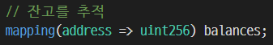

# Chapter 10. 토큰

- 토큰: 기호, 상징이란 뜻. 특수한 사용처에서 가치를 갖는 특수 용도의 (동전과 같은) 물건을 지칭한다. ex> 게임에서 사용되는 토큰
- 물리적 토큰의 한계 / 블록체인 토큰
    - 물리적 토큰은 제한된 사용처에서 의미를 갖고 쉽게 교환될 수 없다는 특징을 가져 가치가 크지 않다.
    - 블록체인을 통해 토큰을 구현하게 된다면 이런 제한이 없어지며 완전히 재정의된다.
    - 다양한 용도로 다양한 장소에서 사용이 가능해지며 거래도 가능해져 더 이상 가치가 작을 이유가 없어진다.


## 1. 토큰은 어떻게 사용되는가?

- 토큰의 가장 분명한 사용처는 디지털 개인 화폐이다.
- 다양한 기능 → 단일 토큰이 다음과 같은 여러 기능을 포함할 수도 있다.
    - 화폐(currency): 토큰은 사적인 트레이딩으로 가치가 결정되는 화폐의 한 형태로 작동할 수 있다.
    - 자원(resource): 공유 경제 또는 자원 공유 환경에서 획득되거나 생산된 자원을 나타낼 수 있다.
    - 자산(asset): 내재적 또는 외적, 유형 또는 무형 자산의 소유권을 나타낼 수 있다.
    - 접근(access): 접근 권한을 나타낼 수 있다.
    - 지분(equity): 디지털 조직 또는 법인의 주주 지분을 나타낼 수 있다.
    - 투표(voting): 디지털 또는 법률 시스템에서 투표권을 나타낼 수 있다.
    - 수집(collectible): 디지털 수집물 또는 물리적인 수집물을 나타낼 수 있다.
    - 신원(identify): 디지털 신원 또는 법적 신원을 나타낼 수 있다.
    - 증명(attestation): 일부 기관이나 탈중앙화된 평판 시스템에 의한 사실 증명서 또는 인증서를 나타낼 수 있다.
    - 유틸리티(utility): 서비스에 접근하거나 사용료를 지불하는 데 사용될 수 있다.


## 2. 토큰과 대체성

- 토큰이 대체 가능하기 위해서는 단일 단위를 값, 기능 차이 없이 다른 토큰으로 대체 가능해야 한다.
    - 일반적인 화폐로 사용되는 토큰은 그런 역할을 한다 할 수 있다.
- 토큰의 과거 출처를 추적 관리할 수 있다면, 그러한 토큰은 완전히 대체 가능하지 않다.
- 토큰이 대체 불가능하기 위해서는(NFT) 과거 출처를 관리하지 못하여야 하고 상호 교환이 불가능해야 한다.
    - NFT의 예시로는 그림, 부동산의 소유권을 나타내는 토큰 등이 있다.


## 3. 거래상대방 위험

- 거래상대방 위험: 트랜잭션에서 상대방이 자신의 의무를 이행하지 못하는 위험이다.
- 자산을 토큰화할때는 거래상대방 위험을 고려하여야 한다.
- 자산 수탁자가 판매, 구매 당사자가 아닌 경우에도 트랜잭션 수행의 당사자가 되기 때문에 거래상대방 위험에 놓이게 된다.
    - 수탁자: 위탁을 받은 사람


## 4. 토큰과 내재성

- 토큰은 그 자체로 의미를 가지는 경우(내재적 가치)가 있고, 다른 가치 있는 것을 나타내는데 사용되는 경우(외재적 가치)가 있다.
- 내재적 가치를 가지는 디지털 자산은 토큰 자체와 마찬가지로 합의 규칙에 의해 관리된다.

    → 내재적 자산을 나타내는 토큰에는 추가적인 거래상대방 위험이 없다는 것을 의미한다.

- 외재적 가치를 가지는 토큰은 토큰의 합의 규칙과는 별개의 규칙으로 관리된다.
    - ex> 부동산, 투표권이 있는 회사 주식, 상표 및 금괴


## 5. 토큰 사용: 유틸리티 또는 지분

- 프로젝트에서 토큰은 모금을 위해 유틸리티 토큰과 지분 토큰을 사용한다.
    - 하지만 국가의 규제와 맞닿는 부분이 있기 때문에 이가 계속 허용될 지는 두고 보아야 한다.
- 유틸리티 토큰: 서비스, 애플리케이션 또는 자원에 접근이 요구되는 곳에 사용된다.

    ex> 공유 스토리지 같은 자원을 나타내는 토큰, 소셜 미디어 네트워크 같은 서비스에 접근하는 토큰

- 지분 토큰: 스타트업 같은 곳의 소유권에 대한 지분을 나타내는 토큰
    - 배당금 및 이익 분배를 위한 무의결권 주식으로 제한되거나, 탈중앙화된 자율 조직의 투표 지분으로 확장될 수도 있다.
    - 여기서 플랫폼의 관리는 토큰 보유자들의 투표에 기반을 둔 시스템을 통해 이뤄진다.


## 6. 이더리움 토큰

- 이더리움 외에도 많은 토큰이 있고, 유명한 비트코인은 그 자체가 토큰이다.
- 그러나 이더리움에서 제시한 토큰 표준은 토큰의 발전에 기여하였다.
    - 블록체인 토큰은 이더리움 이전부터 존재했지만, 이더리움에서 첫 번째 토큰 표준이 소개되고 나서 토큰이 폭발적으로 증가했다.

- 토큰과 이더
    - 토큰은 이더와 혼동하면 안된다.
    - 토큰과 이더의 차이점은 어떤 수준에서 처리되는지에서 비롯된다.
    - 이더는 이더리움 플랫폼의 본질적인 동작인, 프로토콜에서 처리되는 것임에 반면, 토큰은 스마트 컨트랙트 수준에서 처리되고 따라서 토큰을 만들기 위해서는 스마트 컨트랙트를 만들어 처리하여야 한다.
    - 토큰을 만드는 스마트 컨트랙트는 표준을 따르는 것이 바람직하다.

### ERC20 토큰 표준

---

- ERC20: NFT의 표준으로 토큰을 구현하는 컨트랙트에 대한 공통 인터페이스를 정의한다.
    - 따라서 모든 호환 가능한 토큰에 같은 방식으로 접근, 사용이 가능하다.
    - 대다수의 토큰은 현재 ERC20 표준 기반이다.
    - 표준은 최소한의 인터페이스일 뿐 다른 기능을 위해 만들어진 구현을 사용하거나 만들 수도 있다.

→ ERC20은 **대체 가능한 토큰(fungible token)**의 표준으로, ERC20 토큰의 다른 단위가 상호 교환이 가능하고 고유한 특성이 없음을 의미한다.

- ERC20 필수 함수와 이벤트: ERC20을 준수한 토큰 컨트랙트는 최소한 다음 함수, 이벤트를 제공해야 한다.
    - `totalSupply`: 현재 존재하는 이 토큰의 전체 개수를 리턴한다.
    - `balanceOf`: 주소가 주어지면 해당 주소의 토큰 잔액을 반환한다.
    - `transfer`: 주소와 금액이 주어지면 해당 주소로 토큰의 양을 전송한다. 전송을 실행하는 주소의 잔액에서 전송을 실행한다.
    - `transferFrom`: 보낸 사람, 받는 사람 및 금액이 주어지면 한 계정에서 다른 계정으로 토큰을 전송한다. `approve` 와 함께 조합하여 사용한다.
    - `approve`: 수취인 주소와 금액이 주어지면 그 주소가 승인을 한 계정에서 최대 금액까지 여러 번 송금할 수 있도록 승인한다.
    - `allowance`: 소유자 주소와 지출자(spender) 주소가 주어지면, 지출자가 출금할 수 있도록 소유자가 승인한 잔액을 리턴한다.
    - `Transfer`: 전송이 성공하면(`transfer` 또는 `transferFrom` 호출) 이벤트가 트리거 된다.
    - `Approval`: `approve`를 성공적으로 호출하면 이벤트가 기록된다.
- ERC20 선택적 함수
    - `name`: 사람이 읽을 수 있는 토큰의 이름을 반환한다.
    - `symbol`: 사람이 읽을 수 있는 기호(ex> USD)를 반환한다.
    - `decimals`: 토큰 양을 나눌 수 있는 소수 자릿수를 반환한다.

- 솔리디티에서 ERC20 인터페이스 정의

    ```csharp
    contract ERC20 {
       function totalSupply() constant returns (uint theTotalSupply);
       function balanceOf(address _owner) constant returns (uint balance);
       function transfer(address _to, uint _value) returns (bool success);
       function transferFrom(address _from, address _to, uint _value) returns
          (bool success);
       function approve(address _spender, uint _value) returns (bool success);
       function allowance(address _owner, address _spender) constant returns
          (uint remaining);
       event Transfer(address indexed _from, address indexed _to, uint _value);
       event Approval(address indexed _owner, address indexed _spender, uint _value);
    }
    ```

- ERC20 데이터 구조
    - ERC20 구현을 보면 2개의 테이터 구조를 포함하고 있다.
    - 하나는 잔고를 추적하고, 나머지 하나는 허용량을 추적하는 것 → 솔리디티에서는 **데이터 매핑(mapping)**으로 구현된다.
    - 첫 번째 데이터 매핑(잔고 추적)은 소유자별로 토큰 잔액을 내부 테이블로 구현한다.

        `mapping(address => uint256) balances;`

    - 두 번째 데이터 구조는 허용량의 데이터 매핑(허용량 추적)이다.
        - ERC20 토큰을 사용하면 토큰 소유자가 권한을 위임자에게 위임할 수 있는데, 이때 한도를 설정할 수 있다.
        - ERC20 컨트랙트는 기본 키가 토큰 소유자의 주소이고, 지출자 주소와 허용 한도에 매핑되는 2차원 매핑으로 허용량을 추적한다.

        `mapping (address => mapping (address => uint256)) public allowed;`

- ERC20 워크플로: 'transfer' 와 'approve & transferFrom'
    1. `transfer` 함수: 지갑에서 다른 지갑으로 토큰을 보낼 때 사용된다.
    2. `approve` 후 `transferFrom` 사용: 토큰 소유자가 제어를 다른 주소에 위임할 수 있게 해준다. 일반적으로는 토큰 배포 컨트랙트에 위임하는데 사용된다.
        - 이 방법을 위해서는 2개의 트랜잭션이 필요하다.
            - 첫번째는 토큰 소유자가 컨트랙트에 위임을 하는 `approve`를 호출하는 트랜잭션
            - 두번째는 컨트랙트가 사용자와 `transferFrom`를 통해 거래하는 트랜잭션

- ERC20 구현
    - ERC20은 컨센시스 EIP20와 오픈제플린 표준토큰을 사용하는 구현이 있다.
    - 컨센시스 EIP20: 간단하고 읽기 쉬운 ERC20 호환 토큰 구현
    - 오픈제플린 표준토큰: 추가적인 보안 주의사항과 함께 ERC20과 호환된다.
        - 자금 모금, 경매, 베스팅 일정 및 기타 기능을 갖춘 좀 더 복잡한 ERC20 호환 토큰을 구현

### 자체 ERC20 토큰 출시

---

### ERC20 토큰의 문제

---

- 토큰 전송은 특정한 토큰 컨트랙트 상태 안에서 일어나고 수신자의 주소가 아닌 토큰 컨트랙트를 목적지로 한다.
    - 즉, 트랜잭션이 토큰 수신자에게 실제로 보내지는 것이 아니라 받는 사람의 주소가 토큰 컨트랙트 자체의 맵에 추가된다.
    - 따라서 ERC20 토큰을 지원하는 지갑조차도 사용자가 토큰 컨트랙트를 명시적으로 추가하지 않는 한 **토큰 잔액을 인식하지 못한다.**
- 이더는 `send` 함수에 의해 보내지고 컨트랙트의 `payable` 함수 또는 외부 소유 주소에 의해 수신되지만, 토큰은 ERC20 컨트랙트에만 존재하는 함수인 `transfer` 또는 `approve`와 `transferFrom`을 사용하여 전송된다는 차이가 있다.
    - (토큰은 이더와 같은 암호화폐처럼 작동하기 위한 것이지만 차이점이 존재한다.)
- 이더를 보내거나 이더리움 컨트랙트를 사용할 때는 가스 지급을 위한 이더가 필요하다.
    - **토큰을 보내는 데도 이더가 필요하다.**
    - 트랜잭션의 가스는 토큰으로 지급할 수 없고, 토큰 컨트랙트는 가스를 지급할 수 없다.
    - 토큰을 받을 때는 이더가 필요 없었는데, 이 토큰을 외부로 보낼 때는 이더가 필요하게 된다는 점은 혼란스러울 수 있다.
- **토큰은 자체 블록체인을 가지고 있는 암호화폐가 아니다.**
    - 토큰을 보내는데 가스가 필요하지만 토큰으로 바로 지급할 수 없다.


## 7. 문제 해결 위한 제안

### ERC223: 제안된 토큰 컨트랙트 인터페이스 표준

---

- 목적지 주소가 컨트랙트인지 아닌지 여부를 감지함으로써 실수로 토큰을 컨트랙트로 전송하는 문제를 해결한다.
- `tokenFallback` 함수를 통해 토큰을 지원하지 않는 컨트랙트로 전송하는 문제를 해결한다.
    - 토큰을 전송하는 목적지가 컨트랙트인데, 그 컨트랙트에 토큰에 대한 지원이 없는 경우 전송이 실패한다.

### ERC777: 제안된 토큰 컨트랙트 인터페이스 표준

---

- `send` 함수를 통해 토큰 전송
- `tokensToSend` 통해 전송할 토큰 선택 가능
- `tokensReceived` 함수 호출하여 수신자가 토큰을 수신한 사실을 컨트랙트 & 주소에 통지 가능
- ERC777 후크
    - 후크(hooks)란 토큰이 보내지면 호출되는 컨트랙트 내의 함수로 이를 통해 계정과 컨트랙트가 토큰을 수신하는것에 따라 반응할 수 있다.(출처 : OpenZeppelin Docs)

### ERC721: 대체 불가능한 토큰(증서) 표준

---

- 이 전까지의 토큰 표준은 토큰 유닛을 바꿔쓸 수 있는 대체 가능한 토큰에 대한 것이었고, ERC721 표준은 대체할 수 없는 토큰(증서)에 대한 표준을 위한 것이다.
- **증서:** 서명되어 배달된 법적 서류, 특히 재산 또는 법적 권리의 소유에 관한 것
    - ERC721 표준은 증서에 의해 그 소유권이 고유하게 추적될 수 있는 것들을 대상으로 한다.
- ERC20 과 ERC721의 차이

    

    - ERC20은 각 소유자에 속한 잔액을 추적하고 소유자의 주소가 매핑의 기본키이다. 각 계정의 최종 잔액만 추적하고 토큰의 출처는 추적하지 않는다.

    

    - ERC721은 각 증서 ID(256비트 식별자)와 소유권자를 추적하며 증서 ID가 매핑의 기본 키가 된다.
- NFT토큰에 대한 표준이다. NFT 토큰은 게임 아이템, 디지털 수집물 같은 고유한 아이템 부터 실물에 대한 소유권을 추적하기 위한 용도 등으로 사용된다.


## 8. 토큰 표준 사용

### 토큰 표준이란 무엇인가? 그 목적은 무엇인가?

---

- 토큰 표준은 구현을 위해 최소한으로 지켜야 할 것으로, 컨트랙트 간의 상호운용성을 추구한다.

### 이 표준을 사용해야 하는가?

---

- 표준은 특정 방법을 제시하여 혁신을 가로막기도 하지만 경험적으로 제시된 것이기 때문에 대부분 유효한 방법이다.
- 기존 표준을 사용하면 해당 표준을 사용하도록 설계된 모든 시스템의 가치를 얻게 된다.
- 또한 표준을 벗어난다면 상호운용성을 포기해야 하며 기존에 구축된 인프라를 사용할 수 없다.
- 따라서 이를 고려하여 표준을 따를 것인지 고려해야 한다.

### 성숙도에 의한 보안

---

- 표준의 선택을 넘어 구현의 선택이 있다.
- 잘 테스트되고 널리 사용되는 구현을 사용하는 것이 훨씬 안전하다.


## 9. 토큰 인터페이스 표준 확장

- 앞서 설명한 토큰 표준은 기능이 제한된, 매우 최소한의 인터페이스를 제공한다. 많은 프로젝트가 애플리케이션에 필요한 기능을 지원하기 위해 확장된 구현을 만들었다.
- 확장된 기능
    - **소유자 제어(owner control):** 특정 주소 또는 주소 집합(다중서명체계), 블랙리스트, 허용 목록 작성, 복구 등과 같은 특수 기능을 제공하는 기능
    - **소각(burning):** 토큰을 고의로 파괴할 수 있는 주소로 전송하거나 잔액을 지우고 공급을 줄임으로써 의도적으로 토큰을 파괴하는 기능
    - **발행(minting):** 예측 가능한 비율로 또는 토큰 생성자의 승인을 통해 토큰 총 공급량을 추가하는 기능
    - **크라우드 펀딩(crowdfunding):** 경매, 시장 판매, 역 경매 등을 통해 판매용 토큰을 제공할 수 있는 기능
    - **캡(caps):** 총 공급량에 대해 미리 정의된 불변의 제한을 설정할 수 있는 기능(발행 기능의 반대)
    - **복구 백도어(recovery backdoors):** 자금을 복구하거나, 송금을 되돌리거나, 지정된 주소 또는 주소의 집합에 의해 활성화 될 수 있는 토큰을 소거하는 기능
    - **화이트리스트(whitelisting):** 토큰 전송 같은 작업을 특정 주소로 제한할 수 있는 기능
    - **블랙리스트(blacklisting):** 특정 주소를 허용하지 않음으로써 토큰 전송을 제한할 수 있는 기능

→ 추가 기능으로 토큰 표준을 확장하는 데는 혁신/위험과 상호운용성/보안 간의 절충이 필요하다.


## 10. 토큰 및 ICO

- 토큰은 이더리움 같은 모든 스마트 컨트랙트 플랫폼에서 매우 중요한 구성요소가 될 가능성이 크다.
- **ICO(Initial Coin Offering)**: 새로운 암호화폐를 만들기 위해 불특정 다수의 투자자들로부터 초기 개발 자금을 모집하고 그 대가로 코인을 나눠주는 것. ICO는 크라우드 펀딩의 일종으로 초기코인공개 또는 초기코인제공이라고 한다.
- 단기적으로 사기로 가득찬 토큰 ICO 버블로부터 장기적 비전과 이 기술의 영향을 분리하는 것이 필요하다.
