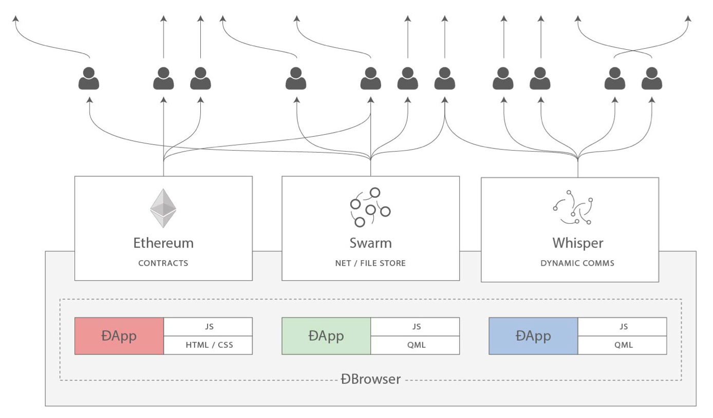

# Chapter 12. 탈중앙화 애플리케이션(댑)

탈중앙화 애플리케이션(Decentralized Applications) == 댑(DApp)




# 1. 댑이란 무엇인가?

댑이란: `대부분 또는 완전히 탈중앙화된 애플리케이션`

- 앱의 탈중앙화 가능 측면

    백엔드 소프트웨어

    - 사설서버 |> 스마트 컨트랙트

    프런트엔드 소프트웨어

    - 웹앱 |> 모바일앱

    데이터 스토리지

    - 폐쇄적 데이터베이스 |> P2P 스토리지

    메시지 통신

    네임 레졸루션

- 댑만이 가지는 장점

    지속성(resiliency)

    - 비지니스 로직 제어는 스마트 컨트랙트로 제어
    - 댑 백엔드는 블록체인 플랫폼에서 완벽하게 탈중화되고 관리
    - 가동중지 시간이 없음[중앙집중식 서버가 없기 때문]
    - 플랫폼이 지속되는 한 사용 가능

    투명성(transparency)

    - 댑의 온체인 특성 ⇒ 오픈소스 ⇒ 누구나 코드 검사 ⇒ 기능에 대한 확신
    - 댑과 상호작용한 모든 내용은 블록체인에 영원히 저장

    검열저항(censorship resistance)

    - 사용자가 이더리움 노드에 접근할 수 있는 한[직접운영도 가능], 중앙화된 컨트롤의 간섭 없이 댑과 항상 상호작용 가능
    - 서비스 제공 업체 또는 스마트 컨트랙트 소유자 또한 네트워크에 배포된 코드 변경 불가

책 지필 시점기준 완전히 탈중앙화된 애플리케이션 드뭄, 대부분 중앙화된 서비스와 서버를 사용하여 작업 일부를 수행

## 1-1. 백엔드(스마트 컨트랙트)

---

스마트 컨트랙트가 일반적인 애플리케이션 서버를 일부 또는 완전히 대체할 수 있음

단, `스마트 컨트랙트`에서의 `코드 실행`은 `비용`이 `비쌈` ⇒ 최소화 유지

따라서 `애플리케이션` 구성 중 `어느 부분`이 `탈중앙화` 플랫폼이 `필요한지 판별`하는게 `중요`

스마트 컨트랙트 아키텍처 설계 고려사항

- 변경불가
    - SELFDESTRUCT 연산코드 프로그래밍을 통한 제거만 가능
- 댑크기[가스 비용]
    - 코드 크기가 크면 배포 및 사용을 위해 많은 양의 가스 소비
    - 오프체인 계산 + 외부 데이터 소스 선택 가능, 단 댑의 핵심 비지니스 로직은 외부자원을 사용자가 신뢰 할 수 있을때만 가능

## 1-2. 프런트엔드(웹 유저 인터페이스)

---

`표준 웹 기술[HTML, CSS, Javascript 등] 사용` 가능

`메세지 서명, 트랜잭션 전송, 키 관리` 같은 `이더리움 상호작용`은 `메타마스크 같은` `확장`을 통해 `웹 브라우저에서 수행`

지필 시점 기준 라이트 클라이언트 역할 수행이 가능한 모바일 클라이언트가 없음 ⇒ 모바일 댑 프런트엔드 개발 자원이 몇개 없음

web3.js 자바스크립트 라이브러리를 통해 이더리움에 연결

## 1-3. 데이터 스토리지

---

높은 가스 비용 + 낮은 블록 가스 한도로 스마트 컨트랙트는 많은 양의 데이터 저장, 처리에 부적합

따라서 대부분의 댑은 오프체인 데이터 스토리지 서비스 사용

- 데이터 스토리지는 중앙화 또는 탈중앙화 가능
- IPFS[Inter-Planetary File System)
    - 탈중앙화된 `컨텐츠 주소 부여 가능` 스토리지 시스템
    - `컨텐츠 해싱[컨텐츠 주소로 사용]` 후 P2P 네트워크의 피어들에게 배포
    - 이후 해시로 모든 IPFS 노드에서 파일 검색
    - 파일코인
- 스웜[Swarm]
    - 스웜 역시 IPFS와 같은 컨텐츠 주소 부여 가능한 P2P 스토리지 시스템
    - 아직 미완성

## 1-4. 탈중앙화 메세지 통신 프로토콜

---

댑의 가장 주목할 만한 P2P 메시징 프로토콜 위스퍼[Whisper]

탈중앙화될 수 있는 마지막 특징 네임 레졸루션[name resolution]


# 2. 기본 댑 사례: 경매 댑


- 경매 댑 진행 절차
    - 주택, 자동차, 상표 같은 고유한 자산 증서 토큰[NFT]
    - 토큰 등록시 토큰 소유권이 경매 댑으로 이전
    - 해당 토큰 판매를 위한 판매 리스트에 리스트업
    - 해당 토큰 경매를 위한 대화방 참여 가능
    - 토큰에 대한 사용자 입찰
    - 경매 완료시 낙찰자에게 토큰 소유권 이전
- 경매 댑 구성요소
    - ERC721 대체 불가능 증서 토큰[Non-Fungible "deed" Tokens] 구현 스마트 컨트랙트
    - 경매 구현 스마트 컨트랙트
    - Vue/Vuetify 자바스크립트 웹 프런트엔드
    - 이더리움 체인에 연결하는 web3.js 라이브러리[메타마스크 또는 다른 클라이언트를 통해]
    - 이미지 등 정적 자원을 저장하는 스웜 클라이언트
    - 모든 참여자를 위해 경매별 대화방을 개설하기 위한 위스퍼 클라이언트

## 2-1. 경매 댑: 백엔드 스마트 컨트랙트

---

- ERC721 대체 불가능 토큰 스마트 컨트랙트

    [ethereumbook/DeedRepository.sol at develop · ethereumbook/ethereumbook](https://github.com/ethereumbook/ethereumbook/blob/develop/code/auction_dapp/backend/contracts/DeedRepository.sol)

- 경매 스마트 컨트랙트

    [ethereumbook/AuctionRepository.sol at develop · ethereumbook/ethereumbook](https://github.com/ethereumbook/ethereumbook/blob/develop/code/auction_dapp/backend/contracts/AuctionRepository.sol)

- 댑 거버넌스
    - 경매 댑[스마트컨트랙트] 자체[각 경매에는 특별한 능력을 가진 소유자가 있음]에는 특별한 권한을 가진 계정이나 역할이 없음
        - 댑 거버넌스를 탈중앙화하고 한번 배포시 모든 통제권을 포기하게 만들기 위한 선택
    - 일부 댑은 컨트랙트 무시, 설정 변경, 특정 작업 거부 등을 할 수 있는 하나 이상의 특권을 가진 계정을 보유
        - 이러한 기능은 버그로 인해 발생되는 문제를 피하기 위해 댑에 적용
    - 거버넌스 문제: 양날의 검
        - 특정 권한이 있는경우 탈취되면 아사리
            - 탈중앙화 거래소 뱅코어 특권 계정 탈취로 대규모 절도
        - 없는경우 잘못짜면 아사리
        - 진정한 댑은 특정 권한 없이 돌아야 함
            - 한마디로 절라 잘 계획하고 잘짜야 한다.. 열심히고 뭐고 없다!

## 2-2. 경매 댑: 프런트엔드 사용자 인터페이스

---

- 경매 댑의 컨트랙트가 배포 후
- 사용자는 선호 자바스크립트 콘솔과 web3.js[다른종류도 많다고 함]를 사용하여 댑과 상호작용
- 책 경매 댑에선 Veu2/Veutify 사용


# 3. 경매 댑을 더 탈 중앙화하기

- 댑을 탈중앙화하고 복원력 좋게하는 방법 두가지
    - 모든 애플리케이션 코드를 스웜 또는 IPFS에 저장
    - 이더리움 네임 서비스를 사용하여 네임 참조를 통한 댑 접근


# 4. 스웜에 경매 댑 저장하기

- 예제 경매 댑은 이미 스웜을 사용하여 각 경매 아이콘 이미지를 저장
- 비싼 이더리움에 데이터 저장하는거 보다 효율적
- 웹 서버나 파일 서버 같은 중앙화 서비스에 저장되는 것 보다 복원력이 좋음
- 댑 자체의 프런트앤드 전체를 스웜에 저장하고 웹 서버 대신 스웜 노드에서 직접 실행 가능

## 4-1. 스웜 준비하기

---

- 스웜은 고-이더리움 도구 모음의 일부
- 스웜 설치 및 노드 초기화 필요
- 책상엔 이리 나와 있는데 링크 죽었고 바뀌었음

    ```bash
    $ swarm version
    Version: 0.3
    Git Commit: 37685930d953bcbe023f9bc65b135a8d8b8f1488
    Go Version: go1.10.1
    OS: linux
    ```

- 현재 운영중인 스웜

    [Quick Start | Swarm Bee Client](https://docs.ethswarm.org/docs/installation/quick-start)

## 4-2. 스웜에 파일 올리기

---

[Upload and Download Files | Swarm Bee Client](https://docs.ethswarm.org/docs/access-the-swarm/upload-and-download)

- 이거 공짜 맞나?
- BZZ 코인? 이건 또 뭐야!!


# 5. 이더리움 네임 서비스(ENS)

- DNS(Domain Name System) 서비스와 비슷

## 5-1. 이더리움 네임 서비스의 역사

---

- ENS는 2017년 5월 4일 스타워즈 데이에 출시

## 5-2. ENS 사양

---

- EIP-137, EIP-162, EIP-181에 명시
- 샌드위치 디자인 철학

    맨아래계층 ⇒ 중간계층 ⇒ 최상위 계층

## 5-3. 맨 아래 계층: 이름 소유자 및 리졸버

---

- ENS는 이름 대신 노드로 작동
- 변환과정
    - 이름 ⇒ 네임해시 알고리즘 ⇒ 노드
- 이 계층은 노드의 소유자가 자신의 노드에 대한 정보(특히 리졸버, 소유권 또는 소유권 이정)를 설정 새 하위 노두의 소유자를 만들 수 있게 하는 기능의 50줄 미만 단순 스마트 컨트랙트[ERC137]
- 네임해시 알고리즘
    - 어떤 이름이라도 그 이름을 식별 가능한 해시로 변환 가능한 재귀 알고리즘
    - mastring-ethereum.eth 네임해시 파이썬 예

        ```python
        namehash('mastering-ethereum.eth')
        ⇒ sha3(namehash('eth') + sha3('mastering-ethereum'))
        ⇒ sha3(sha3(namehash('') + sha3('eth')) + sha3('mastering-ethereum'))
        ⇒ sha3(sha3(('\0' * 32) + sha3('eth')) + sha3('mastering-ethereum'))
        ```

    - 하위 도메인 구조 예
        - subdomain.example.eth
        - sub.sub.domain.example.eth
        - sub.sub.subdomain.example.eth
- 유효한 이름 선택 방법
    - 이름은 일련의 점으로 구분된 라벨로 구성
    - 대문자 소문자 모두 허용, 해시 처리전 [`UTS #46`](https://unicode.org/reports/tr46/) 정규화 프로세스 따름
    - 권장규칙
        - 라벨은 64자를 넘지 않음
        - 완전한 ENS 이름은 255자를 넘지 않음
        - 라벨은 하이픈으로 시작하거나 끝나서는 안되며 숫자로 시작도 안됨
- 루트 노드 소유권

    궁극목표 = 새로운 TLD들을 위한 탈중앙화된 의사결정 프로세스 구축

    - 최상위 도메인(Top-Level Domain, TLD)을 만들 수 있는 루트 노드 소유자에 의존
    - 책 지필 시점 루트 노드는 4 of 7 멀티시그에 의해 컨트롤
    - 여러 국가에 키홀더들이 나누어져 존재[DNS 시스템의 7개 키홀더 구조를 본떠서 만듬]
    - 변경을 위해서는 4/7의 동의가 있어야 가능
    - 키홀더의 목적과 목표 4가지
        - 시스템 검증 후 .eth TLD의 임시 소유권을 컨트랙트로 마이그레이션 & 업그레이드 함
        - 커뮤니티는 TLD가 필요 동의 할 시 새로운 TLD들의 추가를 허용
        - 그 시스템이 합의, 테스트, 구현될 때 루트 다중 서명의 소유권을 더 탈중앙화된 컨트랙트로 마이그레이션
        - 최상위 저장소의 모든 버그 또는 취약점을 처리하는 최후의 수단으로 사용
- 리졸버
    - 기본 ENS 컨트랙트는 이름에 메타데이터 추가 불가
    - 리졸버 컨트랙트는 앱과 관련된 메타데이터[스웜주소, 앱 지불 주소, 앱 해시] 생성 컨트렉트

## 5-4. 중간 계층: .eth 노드

---

집필 시점 스마트 컨트랙트에서 유일 등록 가능한 `최상위 도메인`: `.eth`

- 전통적인 DNS 도메인 소유자가 ENS 소유권 주장 가능토록 하는 작업 진행 중
    - com에서도 작동 가능 하지만, 현재 .xyz이며, 롭스턴 테스트 네트워크에서만 가능
- .eth 도메인은 경매 시스템을 통해 배포
- 예약 목록이나 우선순위가 없으며, 이름을 얻는 유일한 방법은 시스템을 사용하는 것
- 경매코드는 상당히 복잡, ENS 초기 개발 노력 대부분이 이 부분에 포함, 보관된 자금에 대해 리스크 없이 나중에 교체 및 업그레이드 가능
- 전통적 비크레이 경매
    - 전통적인 비크레이 경매는 모든 입찰자가 봉인된 입찰을 제출, 동시에 공개
    - 이때 가장 높은 입찰자가 경매에서 이기지만 두 번째로 높은 입찰가만 지불
    - 입찰자는 경매에 붙여진 이름의 실제 가치보다 더 적은 금액의 입찰을 하게 됌
    - 실제 가치에 입찰하는 것이 이길 확률을 높여주기는 하지만, 결국 지불가에는 영향이 없음
- 블록체인 경매
    - 빈입찰 방지를 위해 입찰자는 입찰가와 같거나 높은 금액을 예치[Lock up] 해야 한다
    - 블록체인에서는 비밀이 없기 때문에 입찰자는 입찰에 들어간 원래 가격과 이름을 숨기기 위해 최소 두번의 트랜잭션 실행
    - 탈중앙화 시스템에서 모든 입찰가 동시 공개 불가하기 때문에 입찰자는 스스로 입찰가를 공개해야 한다. 그렇지 않으면 입찰에 예치된 자금은 몰수된다. 이런 몰수가 없다면 입찰은 많이 하고 그중 한두 개만 공개할 수 있으며, 봉인도니 입찰 경매를 전통적인 가격 상승 경매로 바꿀 수 있다.
- 블록체인 경매 4단계 프로세스
    - 경매 시작
        - 이름 등록 의사 브로드캐스트에 필요
        - 모든 경매는 마감 시간을 갖음
        - 이름은 해시 처리되어 자신들의 사전에 이름이 있는 사람들만 경매가 열렸는지 인지
    - 봉인된 입찰
        - 입찰 마감일 전에 주어진 양의 이더를 비밀 메시지 해시[이름의 해시, 입찰의 실제 양 및 솔트]로 묶어서 입찰을 봉인, 입찰양의 추측을 불가능토록 더큰 이더를 잠글 수 있다.
    - 입찰가를 공개
        - 공개 기간에 입찰가를 공개하는 트랜잭션을 해야 함
        - 입찰가가 가장 높은 입찰가와 두번째로 높은 입찰가를 계산하고 낙찰받지 못한 입찰자에게 이더를 페이백 한다.
        - 입찰가 공개시마다 현재 낙찰자 재계산
        - 공개 마감일 전에 마지막으로 설정된 사람이 최종 낙찰자
    - 경매 후 정리
        - 낙찰자는 경매를 종료하고 두번째로 높은 입찰가의 차이를 돌려받을 수 있다.
        - 여러분이 공개하는 것을 잊었다면, 늦게라도 공개하고 여러분의 입찰가 중 조금은 돌려 받을 수 있다.

## 5-5. 최상위 계층: 증서

---

ENS 최상위 계층은 자금을 맡아두는 단일 목적을 지닌 또 다른 매우 단순한 컨트랙트

- 여러분이 이름을 얻었을때 그 돈은 실제로 아무데도 보내지지는 않지만 잠겨있다.[보증금]
- 소유자가 더 이상 이름을 원하지 않으면 시스템으로 다시 판매하고 이더를 복구 할 수 있음
- 단일 컨트랙트가 수백만 달러의 이더를 보유하는 것이 매우 위험
- ENS는 각각의 이름에 대해 증서 컨트랙트를 생성
- 증서 컨트랙트는 매우 간단 그리고 자금은 단일 계정[계정소유자]에게만 전송, 단일 엔티티만 호출됨(이 접근법은 버그(?)로 인해 자금이 위험에 처할 수 있는 공격 영역을 크게 줄였다.)

## 5-6. 이름 등록하기

---


- 이름등록 절차
    - 이름 사용 가능여부 검색

        

    - 메타마스크 잠금 해제

        

    - 입찰 진행

        

    - 입찰가 포함 트랜젝션 전송

        

    - 입찰가 전송 후 48시간 안에 입찰가를 공개하면, 유저 이더리움 주소로 등록

## 5-7. ENS 이름 관리

---

- ENS 관리자

    

    - 관리자를 통해 해당 이름을 댑 프런트앤드 스웜 주소 같은 적절한 자원에 연결 가능
- ENS 하위 도메인 만들기

    

## 5-8 ENS 리졸버

---

- ENS에서 이름 확인 과정 두단계
    - ENS 레지스트리는 해시 후 해석할 이름과 함께 호출, 레코드가 존재하면 레지스트리는 리졸버의 주소를 리턴
    - 리졸버는 요청된 자원에 적절한 메서드를 사용하여 호출, 리졸버는 원하는 결과를 반환

        

## 5-9. 스웜 해시로 이름 해석(콘텐츠)

---

ENS 도메인의 리졸버가 공개 리졸버로 설정시, 스웜 해시를 이름의 컨텐츠로 반환하도록 설정 가능


- 해시를 이용한 경매 댑 검색

    ```python
    https://swarm-gateways.net/bzz:/ab164cf37dc10647e43a233486cdeffa8334b026e32a480dd9cbd020c12d4581
    ```

- 댑 브라우저 스웜 게이트웨이에서 스웜 URL 검색

    ```python
    bzz://ab164cf37dc10647e43a233486cdeffa8334b026e32a480dd9cbd020c12d4581
    ```

- 이름으로 DApp검색

    ```python
    http://swarm-gateways.net/bzz:/auction.ethereumbook.eth/
    ```


# 6. 앱에서부터 댑까지


- 경매 댑 아키텍쳐


# 7. 결론

- 탈중앙화된 애플리케이션은 이더리움 비전의 정점
- 오늘날의 DApp은 완전히 탈중앙화 되어 있지는 않음
- 추후 기술이 더욱 발전되어 DApp이 탈중앙화되어 탄력적이고 검열에 저항력을 보이는 무료웹이 가능할 것임