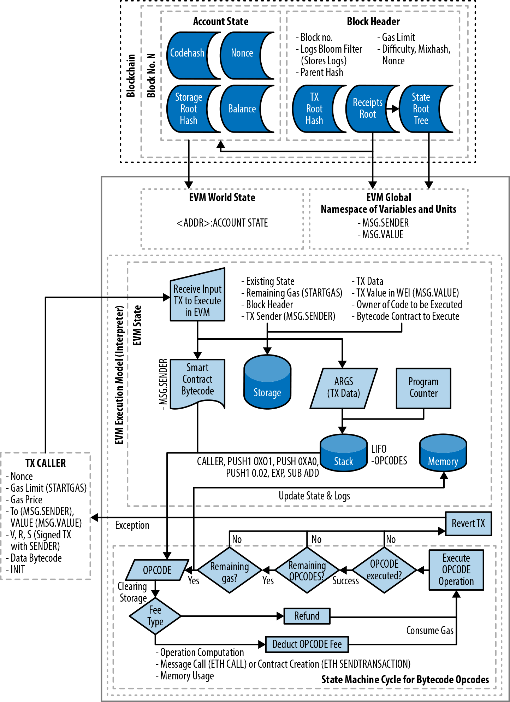

# Chapter 13. 이더리움 가상 머신

# EVM(ethereum virtual machine) 이란 무엇인가

- EVM은 스마트 컨트랙트 배포 및 실행을 처리하는 이더리움의 일부다
- 튜링 완전 상태 머신이다.  → 뒤로가면 `유사튜링완전` 으로 바뀜
- 메모리내 모든 값을 스택에 저장하는 스택기반의 아키텍쳐다.
- 256비트의 단어 크기로 동작한다.  → 요즘 대두되는 문제는 느림
- `프리컴파일` 부분도 이슈가 되고 있고 달구지에서 슈퍼카 튜닝 프로젝트 진행 중


# EVM 아키텍쳐 및 실행 context




# EVM 명령어 집합

- 산술 및 비트논리 연산
- 실행 컨텍스트 조회
- 스택, 메모리 및 스토리지 접근
- 흐름 제어 작업
- 로깅, 호출 및 기타 연산자


# EVM 바이트코드로 솔리디티 소스 컴파일


### 연산코드 출력

`연산코드 파일`

```wasm
/* "example.sol":25:148  contract example2 {... */
  mstore(0x40, 0x80)
  callvalue
  dup1
  iszero
  tag_1
  jumpi
  0x00
  dup1
  revert
tag_1:
  pop
  dataSize(sub_0)
  dup1
  dataOffset(sub_0)
  0x00
  codecopy
  0x00
  return
stop

sub_0: assembly {
        /* "example.sol":25:148  contract example2 {... */
      mstore(0x40, 0x80)
      callvalue
      dup1
      iszero
      tag_1
      jumpi
      0x00
      dup1
      revert
    tag_1:
      pop
      jumpi(tag_2, lt(calldatasize, 0x04))
      shr(0xe0, calldataload(0x00))
      dup1
      0x54353f2f
      eq
      tag_3
      jumpi
    tag_2:
      0x00
      dup1
      revert
        /* "example.sol":77:146  function example() public {... */
    tag_3:
      tag_4
      tag_5
      jump	// in
    tag_4:
      stop
    tag_5:
        /* "example.sol":129:139  msg.sender */
      caller
        /* "example.sol":113:126  contractOwner */
      0x00
      dup1
        /* "example.sol":113:139  contractOwner = msg.sender */
      0x0100
      exp
      dup2
      sload
      dup2
      0xffffffffffffffffffffffffffffffffffffffff
      mul
      not
      and
      swap1
      dup4
      0xffffffffffffffffffffffffffffffffffffffff
      and
      mul
      or
      swap1
      sstore
      pop
        /* "example.sol":77:146  function example() public {... */
      jump	// out

    auxdata: 0xa2646970667358221220ef76f51f6ed38835cf0073e0c36fc070952b16db8584835cf59bd0b1e7461c4264736f6c63430008060033
}
```

### 배포를 위한 바이트코드 생성

`바이트 코드 생성`

```wasm
6080604052348015600f57600080fd5b5060ad8061001e6000396000f3fe6080604052348015600f57600080fd5b506004361060285760003560e01c806354353f2f14602d575b600080fd5b60336035565b005b336000806101000a81548173ffffffffffffffffffffffffffffffffffffffff021916908373ffffffffffffffffffffffffffffffffffffffff16021790555056fea2646970667358221220ef76f51f6ed38835cf0073e0c36fc070952b16db8584835cf59bd0b1e7461c4264736f6c63430008060033
```


# Faucet.sol 컨트랙트 만들기

### 오프라인으로 컴파일 하는 경우 배포 바이트 코드 또는 런타임 바이트코드를 얻을 수 있다.

### 0.4 컴파일러를 구해서 컴파일

`또는`

### 0.8버전에선 원본코드는 컨파일 에러가 나긴하는데 일부 수정하면 됨

`msg.sender.transfer(withdraw_amount)` → **payable요소가 있는 send 와 transfer는 address에 msg.sender를 payble로 감싸줌**

`function () external payable {}` →  **fallback() 함수로 선언**


# 튜링 완전성과 가스

- 어떤 종류의 프로그램이라도 실행할 수 있으면 그 언어는 튜링 완전하다.
- 다만 악의적이나 실수로 무한하게 실행된다면??
- 이를 유사 튜링 완료 머신으로 만들기 위해 가스를 사용하면 해법이 된다.


# 가스

- 가스는 작업을 수행하는데 필요한 계산 및 스토리지 자원을 측정하는 이더리움의 단위다.
- 트랜잭션 수수료가 트랜잭션의 크기만 고려하는 비트코인과 달리 실행에 의해 수행되는 계산 단계를 고려해야한다.
- 가스는 보상버퍼 역할 뿐 아니라 dos 공객 방어수단 역할도 함 → 기억하시죠? 9장 보안^^


## 실행 중 가스 계산

**가스가 고갈되지 않고 EVM의 실행이 성공적으로 끝나면, 사용된 가스 비용이 트랜잭션 비용으로 채굴자에게 지급되고 트랜잭션에 지정된 가스 가격에 따라 이더로 변환 된다.**

`채굴비용 = 가스비용 X 가스가격`

`잔여 가스 = 가스 한도 -가스 비용`

`환불 이더 = 잔여가스 * 가스 가격`

**트랜잭션이 성공하지 않았다면? → 채굴자는 그 시점까지 전산 작업을 수행했으므로 트랜잭션 수수료 만큼 보상 지급 됨**


# 결론

우리는 스마트 컨트랙트 추적과 EVM에서 바이트코드가 어떻게 실행되는지를 통해 이더리움 가상 머신에 대해 살펴보았다.


# 번외) 현재는?

[Breaking Down ETH 2.0 - eWASM and EVM Explained - Ivan on Tech Academy](https://academy.ivanontech.com/blog/breaking-down-eth-2-0-ewasm-and-evm-explained)

[이더리움 가상머신(EVM) 2.0: 이더리움의 심장이 교체된다](https://www.coindeskkorea.com/news/articleView.html?idxno=28961)

[ethereum2.0-ewasm현황 - Steemit](https://steemit.com/ethereum/@sigmoid/ethereum2-0-ewasm)