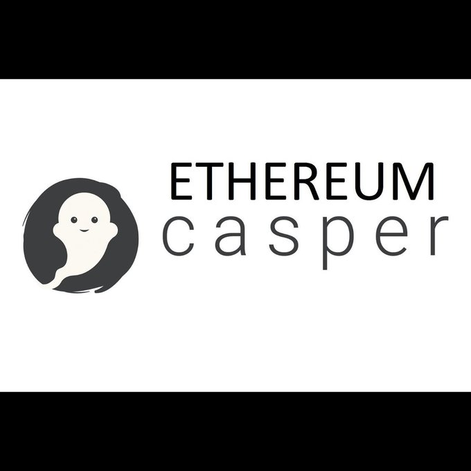

# Chapter 14. 합의

블록체인의 맥락에서 합의는 탈중앙화를 유지하면서 공통의 상태에 도달할 수 있는 것
즉, 합의는 통제자가 없는 **엄격한 규칙 체계**를 만들기 위한 것이다.

# 작업증명을 통한 합의

원본 블록체인 고안자인 비트코인은 작업증명(PoW) 라는 합의 알고리즘을 개발했다.

대부분 채굴이라는 용어로 오해를 일으키지만 이 기능은 가능한 한 많은 참가자로 부터 탈중화된 시스템에 대한 통제권을 유지하면서 블록체인을 보호하는 것

- 이더리움은 현재 PoW(2021년 9월 현재까지) 블록체인이며 동일한 기본 목표를 위한 인센티브 방식을 택했다.
- pow 알고리즘은 이대시(Ethash) 라고 한다.

# 지분증명을 통한 합의

이더리움 창립자들은 처음부터 합의 알고리즘을 궁극적으로는 지분증명으로 옮기기를 희망하고 있었다.

- 실제로 난이도 폭탄이라는 핸드캡이 작업증명에서는 존재하며, 지분증명으로의 전환을 강요한다.
- 이더리움의 지분증명 알고리즘에는 캐스퍼(Casper) 라고 한다.
- 다만 계속 연기되어 난이도 폭탄을 완화하고 지분증명으로의 변경이 연기됨

### 지분 증명의 알고리즘

1. 이더를 컨트랙트에 예치시키는 특별한 유형의 트랜잭션을 보냄으로써 검증인이 될 수 있음
2. 검증인은 유효한 다음 블록에 대해 제안하고 투표하는 순서를 따르며, 각 검증인의 투표 중요도는 보증금의 크기에 따라 다름
3. 여기서 중요한 점은특정 검증인이 보유한 블록이 대다수의 검증인에 의해 거부되면 보증금을 잃을 위험도 있음
4. 반대로 검증인은 대다수가 수락한 모든 블록에 대해 누적된 지분에 비례, 보상을 얻음

# 이대시: 이더리움 PoW 알고리즘

`비탈릭 부테릭` dagger 알고리즘 - `타데우스 드리자`의 hashimoto 알고리즘의 조합을 사용

- 현재까지 asic (주문형 반도체) 채굴자의 위협은 거의 존재하지 않음
- 이더리움 클래식은 작업증명 블록체인으로 남을 것을 약속함

# 캐스퍼: 이더리움 POS 알고리즘

현재 진행 중

- [Ethereum Casper (Proof of Stake)](http://bit.ly/2RO5HAl)
- [History of Casper, Part 1](http://bit.ly/2FlBojb)
- [History of Casper, Part 2](http://bit.ly/2QyHiic)
- [History of Casper, Part 3](http://bit.ly/2JWWFyt)
- [History of Casper, Part 4](http://bit.ly/2FsaExI)
- [History of Casper, Part 5](http://bit.ly/2PPhhOv)

요약

- 하이브리드 알고리즘 으로 제안 되었는데 이건 좀 더 영구 적인 순수 지분증명 알고리즘으로 가기 위한 중간 단계로 구현 된것
- 다만 비탈릭 부테린이 순수 지분증명을 선호해서 하이브리드 모델을 폐기했고,
- 2개의 진영으로 병렬 개발 중

[A model for cumulative committee-based finality](https://ethresear.ch/t/a-model-for-cumulative-committee-based-finality/10259)

# 합의의 원칙

합의 알고리즘 원칙과 가정은 다음 주요 질문을 통해 좀 더 명확하게 이해할 수 있다.

- 누가 과거를 바꿀 수 있고 어떻게 할 수 있는가?(immutability)
- 누가 미래를 바꿀 수 있으며, 어떻게 할 수 있는가? (finality)
- 그러한 변경을 하는 데 필요한 비용은 얼마인가?
- 그러한 변화를 일으키는 힘은 어떻게 탈중앙화되어 있는가?
- 무언가가 바뀌었는지 누가 알 수 있으며, 어떻게 알 수 있는가?

# 논쟁과 경쟁

어떠한 알고리즘도 탈중화된 합의의 모든 문제를 최적화 할 수 없다.

- 어떤 알고리즘이 다른 알고리즘보다 `더 우수` 하다고 제안하면 무엇이 더 나은지 질문해야한다
- 불변성? 최종성? 탈중앙화? 비용? ...
- **결국 역사가 논쟁에 대답할 것이다.**

# 결론

이더리움의 합의 알고리즘은 여전히 유동적이다.