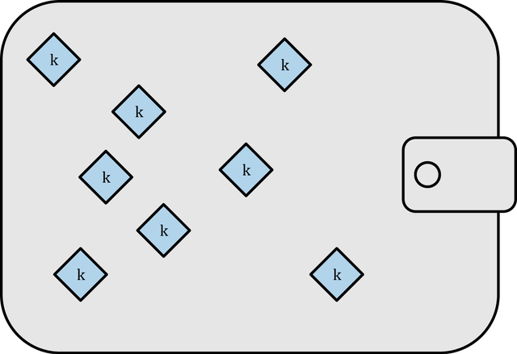
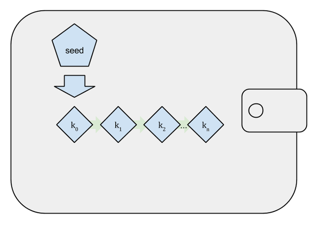
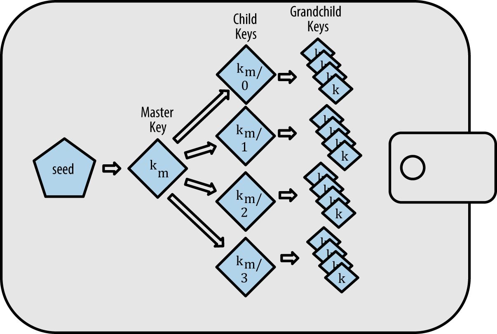
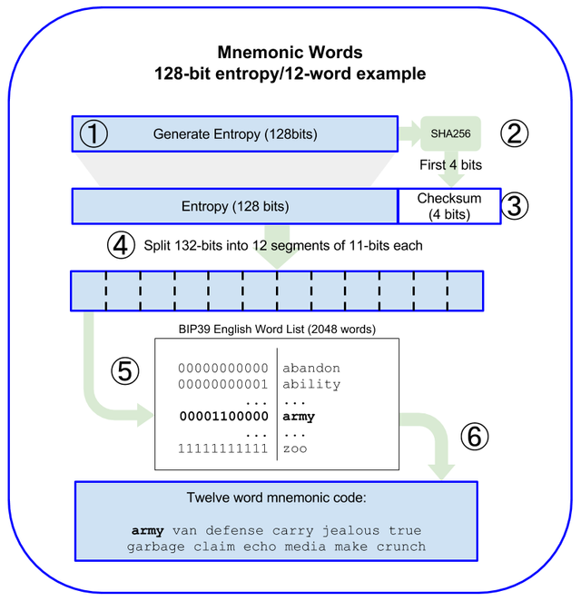
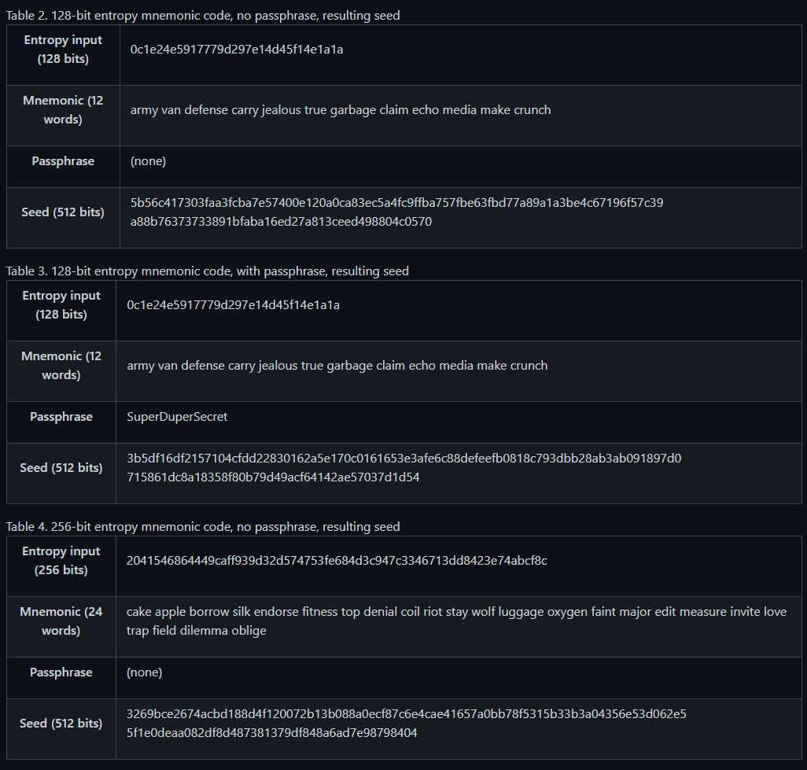
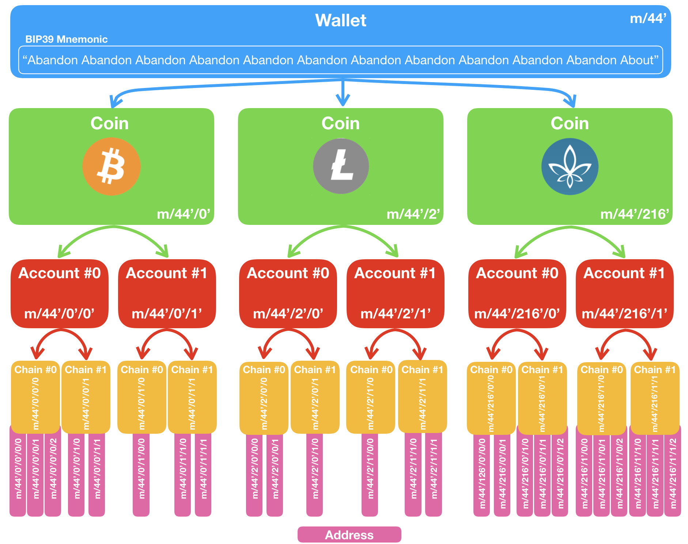

# Chapter 5. 지갑

## 1. 지갑 기술의 개요

이더리움에 대한 오해 중 하나는 지갑이 이더 혹은 토큰을 보유한다라고 생각하는 것

- 실제 이더는 블록체인에 기록되어있고 사용자는 키를 가지고 트랜잭션을 서명함으로써 네트워크에서 토큰을 제어한다
- 지갑은 사실상 키를 보관하는 키체인(개인키 들의 보관함 그리고 키들을 관리하는 시스템)이라고 보는게 타당해보인다.

지갑은 두 가지 형태로 나뉘는데 지갑이 포함하는 키가 서로 관련이 있냐의 유무가 중요

- **비결정적(nondeterministic) 지갑**
    - 무작위 수로부터 각각의 키를 무작위적으로 추출하는 방식
- **결정적(deterministic) 지갑**
    - 모든 키가 시드(seed) 라는 단일 마스터키로부터 파생된다.
    - 여러 가지 키 파생(key derivation) 방식이 있는데 가장 많이 사용하는 방식은 HD지갑의 트리 구조(후술..)
    - 결정적 지갑은 니모닉코드 단어로 복구가 가능


## 2. 비결정적(deterministic) 지갑



- 여러 측면에서 불편하기 때문에 현재는 결정적 지갑으로 대체되고 있음
- 새로운 자금을 받을때마다 새로운 주소(새로운 개인키가 필요한)를 사용한다
- 문제는 키목록이 증가될 수록 정기적인 백업이 필요
- 비결정적 지갑은 그때그때 모두 새로운 주소를 위한 새로운 지갑 파일을 만들기 때문에 다루기가 가장 어렵다

    그럼에도 불구하고 많은 이더리움 클라이언트는 보안강화를 위해 암호문으로 암호화된 단일 개인키가 들어있는, 키저장소(keystore) 파일을 사용한다.

    ```json
    {
        "address": "001d3f1ef827552ae1114027bd3ecf1f086ba0f9",
        "crypto": {
            "cipher": "aes-128-ctr",
            "ciphertext":
                "233a9f4d236ed0c13394b504b6da5df02587c8bf1ad8946f6f2b58f055507ece",
            "cipherparams": {
                "iv": "d10c6ec5bae81b6cb9144de81037fa15"
            },
            "kdf": "scrypt",
            "kdfparams": {
                "dklen": 32,
                "n": 262144,
                "p": 1,
                "r": 8,
                "salt":
                    "99d37a47c7c9429c66976f643f386a61b78b97f3246adca89abe4245d2788407"
            },
            "mac": "594c8df1c8ee0ded8255a50caf07e8c12061fd859f4b7c76ab704b17c957e842"
        },
        "id": "4fcb2ba4-ccdb-424f-89d5-26cce304bf9c",
        "version": 3
    }

    ```

- **cipher** : Private Key 암호화에 사용한 알고리즘의 이름
- **cipherparams** : 위 알고리즘에 필요한 변수
- **ciphertext** : 위 알고리즘으로 Private Key를 암호화한 결과값
- **kdf (Key Derivation Function)**: 패스워드 암호화에 사용한 알고리즘의 이름
- **kdfparams** : 위 알고리즘에 필요한 변수
- **mac** : KeyStore 파일 사용 시, 패스워드 입력값 검증을 위해 사용됨

- **키저장소 형식은 공격을 대비해 키 파생 함수(key derivation function) 을 사용**

[ethereumjs/keythereum](https://github.com/ethereumjs/keythereum)

```jsx
// Note: if options is unspecified, the values in keythereum.constants are used.
var options = {
  kdf: "pbkdf2",
  cipher: "aes-128-ctr",
  kdfparams: {
    c: 262144,
    dklen: 32,
    prf: "hmac-sha256"
  }
};

// synchronous
var keyObject = keythereum.dump(password, dk.privateKey, dk.salt, dk.iv, options);
// keyObject:
{
  address: "008aeeda4d805471df9b2a5b0f38a0c3bcba786b",
  Crypto: {
    cipher: "aes-128-ctr",
    ciphertext: "5318b4d5bcd28de64ee5559e671353e16f075ecae9f99c7a79a38af5f869aa46",
    cipherparams: {
      iv: "6087dab2f9fdbbfaddc31a909735c1e6"
    },
    mac: "517ead924a9d0dc3124507e3393d175ce3ff7c1e96529c6c555ce9e51205e9b2",
    kdf: "pbkdf2",
    kdfparams: {
      c: 262144,
      dklen: 32,
      prf: "hmac-sha256",
      salt: "ae3cd4e7013836a3df6bd7241b12db061dbe2c6785853cce422d148a624ce0bd"
    }
  },
  id: "e13b209c-3b2f-4327-bab0-3bef2e51630d",
  version: 3
}

// asynchronous
keythereum.dump(password, dk.privateKey, dk.salt, dk.iv, options, function (keyObject) {
  // do stuff!
});
```

`KeyStore 암호화&복호화 원리`

[이더리움 KeyStore 파일(UTC) 생성 및 암호화/복호화 원리 (1/2)](https://medium.com/hexlant/%EC%9D%B4%EB%8D%94%EB%A6%AC%EC%9B%80-keystore-%ED%8C%8C%EC%9D%BC-utc-%EC%83%9D%EC%84%B1-%EB%B0%8F-%EC%95%94%ED%98%B8%ED%99%94-%EB%B3%B5%ED%98%B8%ED%99%94-%EC%9B%90%EB%A6%AC-1-2-d417cb605bf)


## 3. 결정적(Seeded) 지갑



- **시드(seed)**라고 하는 단일 마스터 키로부터 파생되는 방식
- 결정적 지갑을 좀 더 안전하게 만들기 위해서 시드는 단어 목록으로 인코딩되어 지갑을 재생성할 수 있게 합니다.
- 이를 **니모닉 코드 단어(mnemonic code words)**라고 합니다.
- 결정적 지갑에서 시드는 모든 파생된 키를 복구할 수 있습니다.
- 그렇기 때문에 시드의 보안이 가장 중요


## 4. HD 지갑(BIP-32/BIP-44)



- `계층결정적[HD(Hierarchical Deterministic)]`
- 단일 시드로부터 아주 많은 키를 쉽게 추출하기 위해 개발
- 트리 구조(부모 키가 연속 된 자식 키를 유도할 수 있고, 각각의 자식 키는 손자 키를 유도할 수 있음)의 유도 된 키를 포함
- 현재 가장 개선된 형태의 지갑 (비트코인의 BIP-32 표준에 정의)

`BIP-32표준`

[bitcoin/bips](https://github.com/bitcoin/bips/blob/master/bip-0032.mediawiki)

- 이런 구조의 몇가지 장점이 있음
    - 트리 구조는 서브키로 특정 분기 브랜치 입금을 받는데 사용하고, 또 다른 분기는 잔액을 받는데 사용하는 식으로 구분 할 수 있음
    - 개인키에 접속하지 않고도 사용자가 공개키 시퀀스를 만들 수 있음


## 5. 시드와 니모닉 코드(BIP-39)

- 개인 키의 안전한 백업과 복구를 위한 인코딩 방법은 여러가지가 있으나 현재 가장 선호하는 방법은 연속 된 단어를 이용하는 것
- 올바른 순서로 단어를 입력하면 개인 키를 다시 만들 수 있다.
- 요즘 많은 이더리움 지갑(다른 암호화폐 지갑도 마찬가지로)에서 이 표준을 사용
- 호환 가능한 니모닉을 사용하여 백업과 복구를 위해 임포트, 익스포트 가능

왜 니모닉 코드로 인코딩을 하게끔 되었을까

- 16진수 표현

    `FCCF1AB3329FD5DA3DA9577511F8F137`

- 니모닉 단어

    `wolf juice proud gown wool unfair
    wall cliff insect more detail hub`

- 16진수의 경우 받아쓸 때 오류가 발생할 확률🔺, 하지만 니모닉 단어는 틀리면 알아볼 수 있음


## 6. 지갑의 모범사례

- 지갑 기술이 성숙해짐에 따라 일반적인 산업 표준이 등장
- 이런 표준을 통해 지갑은 단일 니모닉에서 여러 개의 다른 암호화폐에 대한 키를 파생시킬 수 있음

일반적인 지갑 표준들

- BIP-39 기반 니모닉 코드 단어
- BIP-32 기반 HD 지갑
- BIP-43 기반 다목적(multipurpose) HD지갑 구조
- BIP-44 기반 복수화폐(multicurrency) 및 복수계정(multiaccount) 지갑

    → 소프트웨어 지갑 : Jaxx,MetaMask, MyCrypto, MyEtherWallet

    → 하드웨어 지갑 : Keepkey, Ledger, Trezor


## 7. 니모닉코드 단어(BIP-39)

- 결정적지갑을 유도하기 위한 시드로 사용되는 난수를 인코딩하는 단어 시퀀스
- 나열된 단어들은 시드를 다시 만들 수 있고, 그것으로 파생된 키들을 다시 만들 수 있음

### 7-1. 니모닉 단어 생성

**니모닉 코드 생성하는 순서**

1. 암호학적으로 랜덤한 128 ~ 256 bits의 시퀀스 S를 만든다.

2. S의 SHA-256 해시 값 중에서 앞(왼쪽)에서 S의 길이에서 32 bits로 나눠 체크섬으로 만든다.

3. 2번에서 만든 체크섬을 S의 끝에 추가한다.

4. 3번에서 만든 시퀀스와 체크섬의 연결을 11 bits 단위로 자른다.

5. 각 각의 11 bits를 2048(2^11)개의 미리 정의 된 단어로 치환한다.

6. 단어 시퀀스로부터 순서를 유지하면서 니모닉 코드를 생성한다.

`니모닉 단어 리스트`

[bitcoin/bips](https://github.com/bitcoin/bips/blob/master/bip-0039/bip-0039-wordlists.md)



[엔트로피와 단어 길이](https://www.notion.so/a289f1406bf143988cbc317e216306e0)

### 7-2. 니모닉에서 시드까지

- 엔트로피는 키 스트레칭 함수 `PBKDF2` 를 사용해서 더 긴 시드(512bits)를 파생하는데 사용
- 키 스트레칭함수에는 `니모닉` , `솔트` 라는 두 가지 파라미터가 있음

니모닉 단어 생성 후 7~9단계

7. `PBKDF2` 키 스트레칭 함수의 첫 파라미터는 아까 6단계에서 생성된 니모닉이다.

8. 두번재 파라미터는 `솔트` 로 니모닉+ 선택적으로 사용 가능 

9. `PBKDF2` 는 512비트 값을 만드는 HMAC-SHA512 알고리즘으로, 2048 해시 라운드를 사용하여 `니모닉`, `솔트` 파라미터를 확장, 이 결과로 나온 값이 `시드`


~~잘 안 보이네;;~~



[ethereumbook/ethereumbook](https://github.com/ethereumbook/ethereumbook/blob/develop/05wallets.asciidoc#mnemonic_128_no_pass)

### 7-3. 선택적 암호문(optional passphrase)

❤ 장점 요소

- 니모닉 자체만으로는 의미가 없도록 만들어 도난에서 보호 될 수 있는 2차 팩터 기능
- 공격자의 협박 때문에 암호문을 가르쳐줘야 할 경우에 가짜 암호문 제공 가능

🖤 단점 요소

- 암호문을 알고 있는 사람이 없으면 모든 자금을 영원히 잃게 됨
- 반대로 암호문과 시드를 동일한 위치에 백업하면 2차팩터의 목적이 없음(무의미)

`니모닉 생성기`

[BIP39 - Mnemonic Code](https://iancoleman.io/bip39/#korean)

`니모닉 라이브러리`

***[python-mnemonic](https://github.com/trezor/python-mnemonic)***

The reference implementation of the standard by the SatoshiLabs team that proposed BIP-39, in Python

***[ConsenSys/eth-lightwallet](https://github.com/ConsenSys/eth-lightwallet)***

Lightweight JS Ethereum wallet for nodes and browser (with BIP-39)

***[npm/bip39](https://www.npmjs.com/package/bip39)***

JavaScript implementation of Bitcoin BIP-39: Mnemonic code for generating deterministic keys


## 8. 시드로 HD 지갑 생성하기

- HD 지갑은 시드(128,256,512BITS) 의 랜덤한 숫자에 의해 만들어짐
- HD 지갑의 모든 키는 루트 시드로 파생되었기 때문에 모든 호환 HD 지갑에서 전체 HD 지갑을 재생성 가능


## 9. HD 지갑(BIP-32)과 경로(BIP-43/44)

`BIP-32표준` 다시 나옴

[bitcoin/bips](https://github.com/bitcoin/bips/blob/master/bip-0032.mediawiki)

- 대부분의 HD 지갑은 결정적 키 생성을 위한 산업계의 표준인 BIP-32 표준을 따름
- 하지만 여기선 BIP-32 세부적인 부분 논의 X
- 확장키(extended key) 와 강화키(hardened keY)의 아이디어 이해가 중요

`독립형 BIP-32 생성기`

[BIP32 - JavaScript Deterministic Wallets](http://bip32.org/#bip32)

### 9-1. 확장된 공개키와 개인키

- BIP-32 에서 정의한 방법으로 키는 확장될 수 있다
- 확장된 부모 키는 자식 키를 파생 가능, 계층 구조로 만들 수 있음
- 개인키이면 접두어 `xprv`로 구분되는 확장된 개인키

    `xprv9s21ZrQH143K2JF8RafpqtKiTbsbaxEeUaMnNHsm5o6wCW3z8ySyH4UxFVSfZ8n7ESu7fgir8i...`

- 확장된 공개키이면 접두어 `xpub`로 구분

    `xpub661MyMwAqRbcEnKbXcCqD2GT1di5zQxVqoHPAgHNe8dv5JP8gWmDproS6kFHJnLZd23tWevhdn`

### 9-2. 강화된 자식키 파생(Hardened child key derivation)

- 확장키의 단점
    - 확장된 `공개키`는 `체인코드`를 포함, 자식 `개인키`가 유출될 경우 다른 모든 자식 `개인키`를 유도 가능, 부모 `체인코드`와 `개인키`를 추론 할 수도 있어서 위험
- 이러한 위험에 대응하기 위해 `강화파생`(hardened derivation) 함수를 사용, 부모 `공개키`와 자식 `체인코드` 간의 관계를 끊음
- 자식 `체인코드`를 파생하기 위해 부모 `공개키` 대신 `개인키`를 사용

### 9-3. 일반 및 강화 파생을 위한 인덱스

- 일반 유도 방식의 인덱스 번호 : 0 ~ 2^31–1 (`0x0` to `0x7FFFFFFF`)
- 강화 된 유도 방식의 인덱스 번호 : 2^31 and 2^32–1 (`0x80000000` to `0xFFFFFFFF`)

자식 키 표기법

일반 자식키 : `0`

첫번째 강화된  자식키 : `0'`

두번째 강화된 자식키 : `1'` 로 표기하며 인덱스는 `0x80000001`

HD 지갑 인덱스 표시가 i' 이라면, 2^31 + i 를 의미한다.

### 9-4. HD지갑 키 식별자(경로)

- 지갑 키는 각 트리 레벨이 나눠지는 `/` 로 구분한다.
- 마스터 개인키에서 파생된 개인키 `개인키`는 m 으로 시작,
- 마스터 공개키에서 파생된 공개키는 M 을 시작함

[HD 지갑 경로 예제](https://www.notion.so/018d8fe5a95c4242806b25a80a2a0375)

### 9-5. HD 지갑 트리 구조 탐색

- 이 트리구조에서 부모의 확장키는  40억 개의 자식을 가질 수 있음(`20억 일반키, 20억 강화키` )
- 한마디로 무한에 가까움
- 두 가지 BIP(43,44) 는 HD지갑 표준을 만들어 관리 방법 제공
- BIP-43 지갑은 트리 LEVEL-1 만 사용해야한다 (예: `m/i'/...`  )
- BIP-44 는 미리 정의 된 5단계의 트리 구조를 지정

`BIP-44 트리구조`  m / purpose' / coin_type' / account ' / change / address_index

level 1 : 무조건 44' 

level 2 : 크립토코인 종류를 지정 

level 3 : 회계 목적의 레벨 `accounting or organizational purposes`  

level 4 : BIP-44 가 비트코인을 위해 제작되었기 때문에 있는 레벨인데 입금주소, 잔액주소로 나뉨

level 5 : 주소 인덱스

`lv2 의 크립토코인 인덱스`

[satoshilabs/slips](https://github.com/satoshilabs/slips/blob/master/slip-0044.md)

**BIP-44 HD 지갑 구조 예시**

- M/44'/60'/0'/0/2 : The third receiving public key for the primary Ethereum account
- M/44'/0'/3'/1/14 : The 15th change-address public key for the 4th Bitcoin account
- m/44'/2'/0'/0/1 : The second private key in the Litecoin main account, for signing transactions

    



## 결론

---

만만찮다.