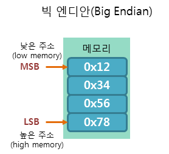

# Chapter 6. 트랜잭션

## 1. 트랜잭션 구조

- serialize 된 트랜잭션을 수신하는 각 클라이언트와 애플리케이션은 자체 내부 데이터 구조를 사용하여 트랜잭션을 메모리에 저장한다.
    - 트랜잭션 메시지의 구조는 이더리움에서 간단하고 완벽한 바이트 serialization 을 위해 특별히 만들어진 RLP(Recursive Length Prefix) 인코딩 체계를 사용하여 serialize 된다.
        - 일반적으로 RLP 는 필드 구분자 또는 라벨을 포함하지 않는다.
            - 수신자, 가스 한도 등
    - 이더리움의 모든 숫자는 8비트 배수 길이의 빅엔디안 정수로 인코딩된다.
        - 빅 엔디안 방식은 낮은 주소에 데이터의 높은 바이트(MSB, Most Significant Bit)부터 저장하는 방식

            

            - 평소 우리가 숫자를 사용하는 선형 방식과 같은 방식
            - 따라서 메모리에 저장된 순서 그대로 읽을 수 있으며, 이해하기가 쉽다.
            - SPARC을 포함한 대부분의 RISC CPU 계열에서는 이 방식으로 데이터를 저장한다.
- 네트워크에서 serialize 된 트랜잭션 자체에는 존재하지 않는 메타데이터가 포함되어 있다.
    - 네트워크 serialization 은 트랜잭션의 유일한 표준 형식이다.

- 트랜잭션: 다음 데이터를 포함하는 serialize 된 바이너리 메시지
    - 논스(nonce): 발신 EOA 에 의해 발행되어 메시지 재사용을 방지하는 데 사용되는 일련 번호
    - 가스 가격(gas price): 발신자가 지급하는 가스의 가격(웨이)
    - 가스 한도(gas limit): 이 트랜잭션을 위해 구입할 가스의 최대량
    - 수신자(recipient): 목적지 이더리움 주소
    - 값(value): 목적지에 보낼 이더의 양
    - 데이터(data): 가변 길이 바이너리 데이터 페이로드
    - v, r, s: EOA 의 ECDSA 디지털 서명의 세 가지 구성요소
- 내부 정보를 보여주거나 사용자 인터페이스를 시각화하기 위해서는 트랜잭션 구조 외에도 트랜잭션/블록체인에서 파생된 추가 정보를 사용한다.


## 2. 트랜잭션 논스

- 논스: 해당 주소에서 보낸 트랜잭션 건수 또는 연결된 코드가 있는 계정의 경우 이 계정에서 만든 컨트랙트 생성 건수와 동일한 스칼라 값
- 논스의 중요성
    - 트랜잭션 생성 순서대로 포함된다.
    - 트랜잭션 복제 방지 (각각의 개별 트랜잭션은 고유하다)
- 비트코인 프로토콜: 미사용 트랜잭션 아웃풋
- 이더리움: 계정 기반 프로토콜. 논스를 사용하는 것이 실제로 필수적이다.

### 논스 추적

---

- 논스는 각 계정에서 발생한 확인된(즉, 체인상의) 트랜잭션 건수에 대한 최신 통계
- 논스 값 알아내기: 메타마스크 실행 상태에서 브라우저에서 자바스크립트 콘솔을 열거나, truffle console 명령으로 자바스크립트 web3 라이브러리에 접근 후 다음 입력

    

- 논스는 0부터 시작하는 카운터로, 첫 번째 트랜잭션의 논스는 0이다. 트랜잭션 건수는 40으로, 0부터 39까지의 논스가 사용되었다. 다음 트랜잭션의 논스는 40이어야 한다.
    - 트랜잭션을 만들 때 시퀀스상 다음 차례 논스 값을 부여한다. 하지만 이 트랜잭션이 컨펌될 때 까지는 합계에 추가되지 않는다.

    ```bash
    > web3.eth.getTransactionCount("0x9e713963a92c02317a681b9bb3065a8249de124f", \
    "pending")
    40
    > web3.eth.sendTransaction({from: web3.eth.accounts[0], to: \
    "0xB0920c523d582040f2BCB1bD7FB1c7C1ECEbdB34", value: web3.toWei(0.01, "ether")});
    > web3.eth.getTransactionCount("0x9e713963a92c02317a681b9bb3065a8249de124f", \
    "pending")
    41
    > web3.eth.sendTransaction({from: web3.eth.accounts[0], to: \
    "0xB0920c523d582040f2BCB1bD7FB1c7C1ECEbdB34", value: web3.toWei(0.01, "ether")});
    > web3.eth.getTransactionCount("0x9e713963a92c02317a681b9bb3065a8249de124f", \
    "pending")
    41
    > web3.eth.sendTransaction({from: web3.eth.accounts[0], to: \
    "0xB0920c523d582040f2BCB1bD7FB1c7C1ECEbdB34", value: web3.toWei(0.01, "ether")});
    > web3.eth.getTransactionCount("0x9e713963a92c02317a681b9bb3065a8249de124f", \
    "pending")
    41
    ```

### 논스의 간격, 중복 논스 및 확인

---

- 트랜잭션을 프로그램을 통해 생성하는 경우, 특히 여러 독립 프로세스에서 동시에 트랜잭션을 생성하는 경우에는 논스 추적이 중요하다.

- 여러 트랜잭션을 순서대로 생성하고 그 중 하나가 공식적으로 모든 블록에 포함되지 않으면 이후 모든 트랜잭션이 '멈추고' 누락된 논스를 기다린다.
    - 만약 논스가 0인 트랜잭션 전송 후 논스가 2인 트랜잭션을 전송하면, 두 번째 트랜잭션은 어떤 블록에도 포함되지 않는다. 이더리움 네트워크는 누락된 논스가 나타날때 까지 기다리는동안 두 번째 논스를 멤풀(mempool)에 ****저장된다.
    - 그 다음 논스가 1인 누락된 트랜잭션을 전송하면, 두 트랜잭션이 처리가 되고 블록에 포함된다.
- 유효하지 않거나 가스가 모자란 트랜잭션은 논스 시퀀스에 의도치 않게 '갭'을 만들 수 있다.
- 다시 트랜잭션이 계속되게 하려면 누락된 논스가 있는 유효한 트랜잭션을 전송해야한다.

### 동시 실행, 트랜잭션 생성 및 논스

---

- 이더리움처럼 탈중앙화되어 있고 분산되어 있는 실시간 시스템에서 동시 실행은 더욱 중요하다.

- 동일한 핫 월렛 계정에서 여러 컴퓨터가 트랜잭션을 생성, 서명 및 브로드캐스트하는 방식은 어떻게 조율될 수 있을까?
    - 단일 컴퓨터를 사용하여 트랜잭션에 서명하는 컴퓨터에 선착순으로 논스를 할당
    - 트랜잭션을 생성하고 논스를 할당하지 않는 것(논스는 트랜잭션 데이터의 필수 부분이므로 트랜잭션을 인증하는 디지털 서명에 포함)


## 3. 트랜잭션 가스

- gas
    - 이더가 아니라 이더에 대한 자체 환율을 가진 별도의 가상 화폐
    - 이더 가치의 급격한 변화와 함께 발생할 수 있는 변동성으로부터 시스템을 보호
    - 가스가 지급하는 다양한 자원의 비용 사이의 중요하고 민감한 비율을 관리하기 위해 가스를 이더와 분리
- 지갑은 신속한 트랜잭션 컨펌을 위해 gasPrice 를 조정할 수 있다.
    - gasPrice ↑: 트랜잭션 빨리 컨펌
    - gasPrice ↓: 우선순위 낮은 트랜잭션에 낮은 가격 설정해 컨펌이 느려지게 할 수 있다.
- 최소 gasPrice는 0, 수수료 없는 트랜잭션을 의미, 블록 공간에 대한 수요가 낮은 기간에는 이 트랜잭션들도 블록에 포함될 수 있다.
- web3 인터페이스는 여러 블록에 걸친 중간 가격을 계산하여 getPrice 제안하는 기능 제공

    

- gasLimit
    - 트랜잭션을 완료하기 위해 트랜잭션을 시도하는 사람이 기꺼이 구매할 수 있는 최대 가스 단위 수
    - 단순 지급: 하나의 EOA 에서 다른 EOA 로 이더를 전송하는 트랜잭션
        - 필요한 가스양은 21,000개의 가스 단위로 고정된다.
    - 얼마나 많은 양의 이더가 소비되는지 계산하려면, 지급하고자 하는 gasPrice에 21,000을 곱하면 된다.

        

- 트랜잭션 목적지 주소가 컨트랙트인 경우, 필요한 가스양을 추정할 수 는 있지만 정확하게 결정할 수는 없다.


## 4. 트랜잭션 수신자

- to 필드에 트랜잭션 수신자가 지정되며 20바이트 이더리움 주소를 포함한다.
- 20바이트 값이 개인키가 없거나 상응하는 컨트랙트가 없는 주소의 경우에도 트랜잭션은 여전히 유효하며, 이더리움은 이 필드를 더는 검증하지 않는다.


## 5. 트랜잭션 값과 데이터

- 트랜잭션의 주요 '페이로드(payload)'는 값(value)과 데이터(data)라는 2개의 필드에 포함된다.
- 지급(payment): 값만 있는 트랜잭션

    

    

- 호출(invocation): 데이터만 있는 트랜잭션

    

    

- 지급과 호출: 값과 데이터 둘다 있다.

    

    

- 값과 데이터 둘 다 없는 트랜잭션: 단지 가스 낭비일 뿐이지만, 가능하긴 하다.

    

    

### EOA 및 컨트랙트에 값 전달

---

- 지급(payment)(값을 포함하는 이더리움 트랜잭션)는 대상 주소가 컨트랙트인지 여부에 따라 다르게 작동
- EOA 주소의 경우: 상태변경을 기록하여 주소 잔액에 보낸 값을 추가한다.
- 목적지 주소(to)가 컨트랙트인 경우: EVM 은 컨트랙트를 실행하고 트랜잭션의 데이터 페이로드에 지정된 함수를 호출하려고 시도한다.
- 트랜잭션에 데이터가 없으면 EVM 은 폴백(fallback)함수를 호출하고, 해당 함수가 지급 가능하다면 다음에 수행할 작업을 결정하기 위해 함수를 실행한다.

### EOA 또는 컨트랙트에 데이터 페이로드 전달

---

- 데이터를 포함한 트랜잭션의 받는 주소는 컨트랙트 주소가 될 가능성이 크다.
- 트랜잭션이 컨트랙트 주소로 데이터를 전달한다고 가정
    - 이 경우 데이터는 EVM 에 의해 컨트랙트 호출(contract invocation)로서 해석된다.
    - 함수 호출(function invocation)로 사용하며, 명명된 함수를 호출하고 인코딩된 인수를 함수에 전달한다.
- 함수 선택기(function selector): 함수 프로토타입의 Keccak-256 해시의 처음 4바이트. 우리가 원하는 함수를 컨트랙트에게 알리는 역할
- 함수 인수(function argument): 함수의 인수는 ABI 사양에 정의된 다양한 기본 유형에 대한 규칙에 따라 인코딩된다.
- 함수의 프로토타입(prototype)

    ```java
    function withdraw(unit withdraw_amount) public {
    ```

    - 함수 이름은 withdraw 이며, 여기에는 unit (unit256의 별칭) 인 단일 인수가 사용되므로 withdraw의 프로토타입은 `withdraw(unit256)`


## 6. 특별 트랜잭션: 컨트랙트 생성

- 블록체인에 새로운 컨트랙트를 만들어 향후 사용을 위해 배포하는 트랜잭션.
- 컨트랙트 생성 트랜잭션은 제로 어드레스라고 하는 특수 대상 주소로 전송된다.
- 컨트랙트 등록 트랜잭션의 to필드는 0x0주소를 포함한다.
    - 이 주소는 EOA 나 컨트랙트를 나타내지 않는다.
    - 이더를 소비하거나 트랜잭션을 시작할 수 없다.
    - 이 필드는 목적지로만 사용되며, '컨트랙트 작성' 이라는 특별한 의미로 사용된다.

- 제로 어드레스
    - 제로 어드레스를 목적지로 하는 다양한 트랜잭션: 실수로 인한 이더 손실이나 의도적인 이더 연소

    


## 7. 디지털 서명

### 타원 곡선 디지털 서명 알고리즘

---

- 이더리움에서 사용되는 디지털 서명 알고리즘은 ECDSA 이다.
- 이더리움에서의 디지털 서명의 세가지 용도
    - 이더리움 계정과 개인키의 소유자가 이더 지출 또는 컨트랙트 이행을 승인했음을 증명
    - 부인 방지(non-repudiation) 보장
    - 트랜잭션이 서명된 후에는 트랜잭션 데이터가 수정되지 않았고 어느 누구도 트랜잭션 데이터를 수정할 수 없음을 증명

### 디지털 서명 작동 방법

---

- 방법1. 트랜잭션에서 개인키(서명 키)를 사용하여 서명을 만드는 알고리즘
- 방법2. 누구나 트랜잭션과 공개키만 사용하여 서명을 검증할 수 있게 해주는 알고리즘

- 디지털 서명 만들기
    - 이더리움 ECDSA 구현에서 서명된 '메시지'는 트랜잭션이다. (트랜잭션의 RLP 로 인코딩된 데이터의 Keccak-256 해시)
    - 서명 키는 EOA 의 개인키다.

    

    - k: 서명 개인키, m: RLP 인코딩된 트랜잭션
    - F keccak256: Keccak-256 해시 함수
    - F sig: 서명 알고리즘
    - Sig: 결과 서명

    

### 서명 확인

---

- 서명 확인을 위해서는 서명(r 및 s)과 serialize 된 트랜잭션, 그리고 서명을 만드는 데 사용된 개인키에 상응하는 공개키가 있어야한다.

### ECDSA 계산

---

- 일시적인 개인키는 해당 공개키(임시)를 만드는 데 사용되므로 다음과 같은 이점이 있다.
    - 임시 개인키로 사용되는 암호학적으로 안전한 난수 q
    - q 로부터 생성된 상응하는 임시 공개키 Q 와 타원 곡선 생성자 점 G


- q: 일시적인 개인키, r: 일시적인 공개키 x의 자표, k: 개인키, m: 트랜잭션 데이터, p: 타원 곡선의 소수 차수

- 검증은 서명 생성 함수의 반대 프로세스다.
    - 모든 입력이 올바르게 구성되어 있는지 확인한다.
    - w = s-1 mod p 를 계산한다.
    - u1 = Keccak256(m) * w mod p 를 계산한다.
    - u2 = r * w mod p 를 계산한다.
    - 마지막으로, 다음 타원 곡선을 계산한다.

    

    - r, s: 서명 값, K: 서명자의 공개키, m: 서명된 트랜잭션 데이터, G: 타원 곡선 생성자 점, p: 타원 곡선의 소수 차수
- 계산된 포인트 Q 의 x 좌표가 r 과 같으면, 검증자는 서명이 유효하다고 결론을 내릴 수 있다. 서명을 검증할 때 개인키는 알려지지도 공개되지도 않는다.

### 트랜잭션 서명 실습

---

- 유효한 트랜잭션을 생성하려면 발신자는 ECDSA를 사용하여 메시지에 디지털 서명을 해야한다.
- 즉, 실제로는 RLP serialize 된 트랜잭션 데이터의 Keccak-256 해시에 서명하시오 라는 뜻이다.
- 서명은 트랜잭션 자체가 아니라 트랜잭션 데이터의 해시에 적용된다.


## 8. 서명 및 전송 분리(오프라인 서명)

- 트랜잭션이 서명되면 트랜잭션은 이더리움 네트워크로 전송할 준비가 된다.
- 트랜잭션의 서명과 전송을 분리하는 이유
    - 보안
        - 서명 및 전송 기능을 분리하여 각기 다른 시스템(오프라인 및 온라인 장치 각각)에서 수행하는 것을 오프라인 서명(offline signing)이라고 하며, 이는 일반적인 보안 방법이다.
    - 이더리움 트랜잭션의 오프라인 서명 프로세스
        - 현재의 논스 및 사용 가능한 자금을 검색할 수 있는 계정에서 서명되지 않은 트랜잭션을 온라인 컴퓨터에 만든다.
        - 서명되지 않은 트랜잭션을 QR코드 또는 USB 플래시 드라이브를 통해 트랜잭션 서명을 위한 '에어 갭(air-gapped)' 오프라인 장치로 전송한다.
        - 이더리움 블록체인에 브로드캐스트하기 위해, 서명된 트랜잭션을 QR코드 또는 USB 플래시 드라이브를 통해 온라인 장치로 전송한다.

        


## 9. 트랜잭션 전파

- 이더리움 네트워크는 '플러드 라우팅(flood routing)' 프로토콜 사용
- 각 이더리움 클라이언트는 메시(mesh) 네트워크를 형성하는 P2P 네트워크에서 노드(node) 역할을 한다.

- 트랜잭션 전파
    - 서명된 트랜잭션을 생성한 이더리움 노드에서 시작한다.
    - 트랜잭션은 검증된 후 트랜잭션을 생성한 '직접' 연결된 다른 모든 이더리움 노드로 전송된다.
    - 각 이웃 노드는 트랜잭션을 수신하자마자 즉시 유효성을 검사한다.
    - 그들이 그것이 타당하는 데 동의하면, 사본을 저장하고 모든 이웃에게 전파한다.
    - 결과적으로 트랜잭션은 네트워크의 모든 노드가 트랜잭션 사본을 가질 때까지 원래 노드에서 바깥쪽으로 flooding(물결처럼 퍼진다)한다.


## 10. 블록체인에 기록하기

- 노드 중 일부는 채굴을 하며 GPU가 장착된 컴퓨터인 채굴 팜(mining farm)에 트랜잭션 및 블록을 제공한다.
- 채굴 컴퓨터는 트랜잭션 후보 블록에 추가하고 후보 블록을 유효하게 만드는 작업증명을 찾으려고 시도한다.
- 유효한 트랜잭션이 결국 트랜잭션 블록에 포함되어 이더리움 블록체인에 기록된다.
- 생성에서 EOA에 의한 서명, 전파, 그리고 마지막으로 채굴까지 완료된 트랜잭션은 싱글톤의 상태를 변경하고 블록체인에서 지울 수 없는 기록을 남긴다.


## 11. 다중 서명 트랜잭션

- 이더리움에서 다중 서명 트랜잭션 기능을 이용하려면 이더를 다중 서명 요구사항이나 지출 한도와 같이 원하는 지출 규칙으로 프로그래밍한 '지갑 컨트랙트'로 보내야한다.
- 후에 지갑 컨트랙트는 지출 조건이 충족되면 승인된 EOA의 요청에 따라 자금을 보낸다.


## 12. 결론

- 트랜잭션은 EVM이 컨트랙트를 평가하고, 잔액을 업데이트하며, 일반적으로 이더리움 블록체인의 상태를 수정하는 '입력'이다.


- [Notion link](https://www.notion.so/Chapter-6-920f6352b4ab4a99976678f0e74cbd56)
