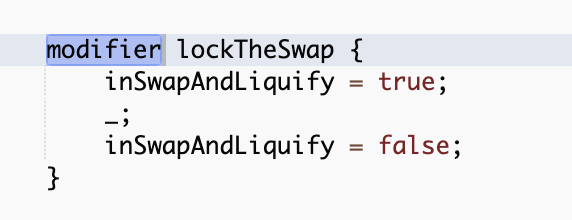

# Chapter 7. 스마트 컨트랙트와 솔리디티

## 개요

이더리움에는 EOA와 컨트랙트, 두가지 유형의 계정이 있습니다. 

EOA와 달리 컨트랙트는 코드와 데이터 저장소를 모두 갖고 있어 EVM에 의해 실행되는 코드가 제어합니다.

컨트랙트는 개인키가 없으므로 **스마트 컨트랙트에 미리 결정된 방식으로 스스로를 제어**합니다.(결정론적)

2가지 계정 모두 이더리움 주소로 식별됩니다.

**준호의 지갑 주소:**
0xCa2cedaC55768fCbd6270dFC6Be21353Ae951010

**토큰 컨트랙트 주소:**
0x2859e4544c4bb03966803b044a93563bd2d0dd4d

이번 장에서는 2가지 계정 중 **컨트랙트 계정과 이를 제어하는 프로그램 코드에 대해 간략히 알아보는 시간**을

가질 것입니다.


## 1.스마트 컨트랙트란 무엇인가?

닉사보 왈 "당사자들이 다른약속에 따라 수행하는 프로토콜을 포함하여 디지털 형식으로 지정된 일련의 약속"

- 컴퓨터 프로그램
- 불변의 - 한번 배포되면 변경할 수 없다.
- 결정론적
- EVM 컨텍스트
- 탈중앙화된 월드 컴퓨터


## 2.스마트 컨트랙트의 생명주기

스마트 컨트랙트는 솔리디티와 같은 고급언어로 작성되나 실행되려면 EVM에서 실행되는 저수준의 바이트코드로

컴파일되어야 함, 일단 컴파일 되면 고유한 컨트랙트 생성 트랜잭션을 사용하여 이더리움 플랫폼에 배포됨.

이더리움의 모든 스마트 컨트랙트는 EOA에서 시작된 트랜잭션으로 인해 실행됨

(백그라운드에서 알아서 돌아가지 않음)

원자성의 특징을 가짐 - 문제가 생겼을 경우 현재 내역을 날려버리고 임시저장했던 상태로 롤백함

컨트랙트는 앞서 말했든 변경할수 없지만, 삭제할 수 있음

selfdestruct함수가 내장되어 있는 스마트 컨트랙트만 가능


## 3. 이더리움 고급 언어의 소개

EVM은 x86_64와 같이 머신 코드를 실행하는 CPU처럼, EVM 바이트 코드를 실행하는 가상머신

바이트코드를 직접 프로그래밍할수는 있지만 까다롭고 프로그래머가 이해하기 어려우므로

대부분 고급언어(솔리디티)를 사용하고 바이트코드로 컴파일함.

일반적으로 프로그래밍 언어는 선언형과 명령형

원래는 선언형이 맞는데 널리 사용하는건 명령형이라고 함

스마트컨트랙트에 대해 현재 지원되는 고급 프로그래밍 언어 목록(개발순서)

- LLL(현재 거의 안쓰임)
- 서펀트(보안성 취약하다고 평가 받음)[https://www.coindesk.com/one-of-ethereums-earliest-smart-contract-languages-is-headed-for-retirement](https://www.coindesk.com/one-of-ethereums-earliest-smart-contract-languages-is-headed-for-retirement)
- 솔리디티(지금까지 주류)
- 바이퍼
- 밤부

이 중 우리는 솔리디티를 공부할 것이며 다른 고급언어의 철학에 대한 이해를 얻기위해

다른 언어도 탐구할것(이라고 하는데 효과적일지 모르겠네요)


## 4. 솔리디티로 스마트 컨트랙트 생성

솔리디티는 개빈우드(이 책의 저자)에 의해 창안되었으며 명시적으로 스마트 컨트랙트 작성을 위해 만들어진 언어(다른언어는 아닌가요?)

시작은 이더리움 코어 개발자들에 의해 시작되었으나 현재는 독립적인 프로젝트로 개발되고 유지됨

주된 제품은 솔리디티언어를 evm바이트코드로 변환하는 solc

**솔리디티 컴파일러의 바이너리를 다운로드후 간단한 예제를 통해 컨트랙트 개발 및 컴파일을 진행해보자**

### 솔리디티의 버전 선택

---

- 시맨틱 버저닝이라고 하는 버전 관리 모델을 따름
- major.minor.patch 점으로 구분된 3개의 숫자를 사용
- 0.4.24 식으로 표기하는데 실제 솔리디티에서는 마이너를 메이저인거처럼 취급한다고 함,
따라서 이 경우 4를 메이저 버전, 24를 마이너 버전으로 간주
- pragma 지시문을 통해 버전 지정
- 솔리디티가 빠르게 발전하고 있으므로 최신 배포판을 설치하는게 좋음(버전업이 너무 잦다)

### 다운로드 및 설치

---

우분투/데비안 운영차제에 설치하는 방법

```jsx
sudo add-apt-repository ppa:ethereum/ethereum
sudo apt update 
sudo apt install solc
```


                                                                 *도커를 사용해봤습니다 ^^*


                                                                                   *설치 완료*

### 개발 환경

---

- 텍스트 편집기 및 커맨드 라인에서 solc를 사용해도 좋고,remix사용해도 좋음
- 트러플 및 하드햇 많이 사용한다고 하네요.

### 단순한 솔리디티 프로그램 작성

---

faucet을 구현하는 솔리디티 컨트랙트

```jsx
pragma solidity ^0.4.22;

contract Faucet {
    
    function withdraw(uint withdraw_amount) public {
        require(withdraw_amount<=10000000000000);
        
        msg.sender.transfer(withdraw_amount);
    }
    function () public payable{}
}
```

작성 후 solc로 컴파일

```jsx
solc --optimize --bin faucet.sol
```

**하면 에러가 뜹니다;;**

```jsx
Error: Expected a state variable declaration. If you intended this as a fallback function or a function to handle plain ether transactions, use the "fallback" keyword or the "receive" keyword instead.
  --> faucet.sol:10:31:
   |
10 |     function () public payable{}
   |                               ^
```

function () public payable {} // 현재는 fallback 함수의 표기가 달라져 에러가 뜸

→receive () payable  external {} //receive로 교체. receive는 외부에서만 호출이 되기에 external로 변경

[https://docs.soliditylang.org/en/v0.8.6/contracts.html?highlight=receive#receive-ether-function](https://docs.soliditylang.org/en/v0.8.6/contracts.html?highlight=receive#receive-ether-function)

**하고 하면... 에러가 또 뜹니다.**

```jsx
TypeError: "send" and "transfer" are only available for objects of type "address payable", not "address". --> dfa.sol:9:9: | 9 | msg.sender.transfer(withdraw_amount); | ^^^^^^^^^^^^^^^^^^^
```

9번째의 msg.sender.transfer(withdraw_amount);를 payable(msg.sender).transfer(withdraw_amount);로 변경하면 된다고 합니다

**이제서야 컴파일 성공**

```jsx
======= faucet.sol:Faucet =======
Binary:
608060405234801561001057600080fd5b5060d88061001f6000396000f3fe60806040526004361060205760003560e01c80632e1a7d4d14602b57600080fd5b36602657005b600080fd5b348015603657600080fd5b5060466042366004608a565b6048565b005b6509184e72a000811115605a57600080fd5b604051339082156108fc029083906000818181858888f193505050501580156086573d6000803e3d6000fd5b5050565b600060208284031215609b57600080fd5b503591905056fea2646970667358221220e03e117c0716fd4f8c116092fb20e4d04c62c634458058ebd0b9bf5f0cd22caf64736f6c63430008060033
```


## 5. 이더리움 컨트랙트 ABI

- ABI는 기계코드와 데이터를 교환하기 위해 인코딩/디코딩 하는 방법
- ABI의 목적은 컨트랙트에서 호출할수 있는 함수 정의, 각 함수가 인수를 받아들이고 결과를 받아들이는 방법을 설명한다고 함
- Json배열로 지정되며 아래와 같은 필드가 있는 json객체(함수와 이밴트 객체로 구성)
- ABI를 사용하면 지갑이나 댑 브라우저같은 애플리케이션은 faucet의 함수를 호출하는 트랜잭션을 생성할수 있다고 함, 예를 들어 지갑이 withdraw함수를 호출하기 위해 withdraw_amount를 사용해야한다는것을 알수 있음

solc --abi faucet.sol

```jsx
Contract JSON ABI
[{"inputs":[{"internalType":"uint256","name":"withdraw_amount","type":"uint256"}],
"name":"withdraw","outputs":[],"stateMutability":"nonpayable","type":"function"},
{"stateMutability":"payable","type":"receive"}]
```

### 솔리디티 컴파일러 및 언어 버전 선택

---

- 책에선 0.4.21버전으로 컴파일이 성공했으나 최신버전의 solc (0.8.6+commit.11564f7e)에선 
에러를 노출하였습니다, 어찌 되었든 우리는 sol문서 상단에 버전을 명시해야합니다.
- 책에는 설명이 없지만 상단에 주석으로 spdx식별자 주석을 달지 않으면 warning이 떠서 달아줬습니다.

```jsx
// SPDX-License-Identifier: GPL-3.0
pragma solidity 0.8.6;
```

주석을 달지 않으면 아래와 같은 경고문이 뜹니다

```jsx
SPDX license identifier not provided in source file.
Before publishing, consider adding a comment containing
"SPDX-License-Identifier: <SPDX-License>" to each source file.
Use "SPDX-License-Identifier: UNLICENSED" for non-open-source code.
Please see https://spdx.org for more information.
```

### 솔리디티로 프로그래밍 하기

---

- 데이터 타입: 부울, 정수형(int, uint), 고정소수점, 주소(address), 바이트 배열, 바이트 크기, 열거형, 배열....
- 

### 사전 정의된 글로벌 변수 및 함수

---

- 트랜잭션/메시지 콜 컨텍스트

### 함수

---


- 함수이름, 인자, 가시성키워드, 동작키워드로 구성
- 일반함수
- 폴백함수

    각 컨트랙트마다 한개의 함수는 이름없이 정의 될수 있으며 이를 fallback함수라고 합니다.

    이 폴백함수는 함수명, 인자값을 지니지 않으며 external형식의 가시성을 지녀야 합니다.

    (다른 언어에서는 돈 받을 일이 없으니 이런 형태의 함수가 없다고 하는데 맞나요?ㅎ)

    function() external payable {} 형태로 개발되었다가 지금은

    receive() external payable{}로 바뀐듯합니다.

    payable이 선언되어야 입금을 받을수 있으며 그렇지 않다면 입금이 거부될것.

    단 selfdestruct함수의 경우 payable이 선언되지 않아도 지불됨

- 가시성 키워드 (visibility modifier)
- 동작 키워드(state modifier) (필수요소 아님)
    - view, pure 이 둘은 외부에서 호출됐을때는 가스를 전혀 소모하지 않습니다

### 컨트랙트 생성자 및 selfdestruct

---

- 오직 한번만 사용되는 특별한 함수
- 실행하여 컨트랙트의 상태를 초기화함
- 이 생성자는 컨트랙트생성과 동일한 트랜잭션에서 실행됨
- **반드시 선택할 필요가 없는 선택사항**

```jsx
// SPDX-License-Identifier: Unlicensed

pragma solidity ^0.6.12;
contract ABC {
    function ABC(){
        
    }
}
```

```jsx
// SPDX-License-Identifier: Unlicensed

pragma solidity ^0.6.12;
contract ABC {
    constructor()public{
        
    }

```

구버전에선 두가지 모두 지원한 모양이나, 생성자 함수가 변경되지 않은 상태에서 컨트랙트 이름만 변경될때 
이 생성자 함수가 더는 생성자 함수로 작동하지 않을 위험성 때문에 아예 constructor로만 제한한듯 합니다.

### 함수변경자

---

- 솔리디티에서 제공하는 특별한 유형의 함수
- 함수 선언에 modifier라는 이름을 추가하여 함수에 변경자를 적용

```jsx
modifier onlyOwner() {
  require(msg.sender == owner);
  _;
}
```

위 함수 변경자는 이름이 onlyOwner, 컨트랙트의 owner로 저장된 주소가 msg.sender와 동일해야 함을 뜻한다. 즉 **컨트랙트 소유자만이 onlyOwner 변경자를 가진 모든 함수를 실행할수 있게 해준다. 예를 들면...**

```jsx
modifier onlyOwner() {
        require(_owner == _msgSender(), "Ownable: caller is not the owner");
        _;
    }

     /**
     * @dev Leaves the contract without owner. It will not be possible to call
     * `onlyOwner` functions anymore. Can only be called by the current owner.
     *
     * NOTE: Renouncing ownership will leave the contract without an owner,
     * thereby removing any functionality that is only available to the owner.
     */
    function renounceOwnership() public virtual onlyOwner {
        emit OwnershipTransferred(_owner, address(0));
        _owner = address(0);
    }

    /**
     * @dev Transfers ownership of the contract to a new account (`newOwner`).
     * Can only be called by the current owner.
     */
    function transferOwnership(address newOwner) public virtual onlyOwner {
        require(newOwner != address(0), "Ownable: new owner is the zero address");
        emit OwnershipTransferred(_owner, newOwner);
        _owner = newOwner;
    }
```

아직 쓰임을 알수 없지만 아래와 같은 생성자도 있으며, 함수에 둘이상의 변경자를 쓸수있으나 
구체적인 예시는 더 찾아보도록 하겠습니다! 



happy token에서 찾은 변경자

본론으로 돌아와 아래를 보시면 publilc 뒤에 변경자 함수인 onlyOwner가 위치해 있으며 이 말은 destroy함수가 onlyOwner 변경자에 의해 한정된다는 것을 말해줌(selfdestruct)는 owner만이 파기할수있다..!

```jsx
function destory() public onlyOwner {
	selfdestruct(owner);
}
```

### 컨트랙트 상속

---

- 바탕이 되는 컨트랙트에 기능을 추가

```jsx
contract child is parent {
}
```

- 다중으로 상속도 가능

```jsx
contract child is parent, parent2 {
}
```

owner 변수가 있는 owned컨트랙트를 생성하고 생성자에서 owner를 설정

```jsx
contract owned {
	adress owner;

constructor() {
	owner = msg.sender
}
modifier onlyOwner {
	require(msg.sender == owner);
	_;
	}
}
```

mortal 컨트랙트에서 owned를 상속받아 onlyOwner변경자 를 사용할수 있음

```jsx
contract mortal is owned {

	function destroy() public onlyOwner {
	selfdestruct(owner);
		}
}
```

### 에러 처리(assert, require, revert)

---

- 솔리디티에서 에러 제어는 assert, require, revert의 함수를 사용
- assert 는 결과가 참일 것으로 예상될 때, require은 입력값이 설정한 조건의 기댓값과 맞는지 테스트할때 씀
- require를 사용하면 특정조건이 참이 아닐때 에러메시지를 나타내고 실행을 멈춤

```jsx
require(msg.sender == owner, "only owner blabla.....");
```

- revert는 컨트랙트 실행을 중지하고 모든 변경상태를 되돌린다, throw는 더이상 사용되지 않음

transfer같은 함수는 이런 설정이 없더라도 에러를 생성할수있다, 출금요청을 만족시킬수 있는 이더가 충분하지 않은 경우 명시적으로 확인하지 않고 에러를 내 실패하며, 해당 트랜잭션을 되돌릴것

그러나 실패시 에러메시지를 분명하게 제공하여 명시하는것이 좋다, 이같은 에러 포스팅이 가스 소비량을 약간 증가시키겠지만 생략되는거보다 더 나은 에러 포스팅을 얻을수 있음

### 이벤트

---

트랜잭션 완료후 트랜잭션 영수증을 발행.

```jsx
// SPDX-License-Identifier: CC-BY-SA-4.0

// Version of Solidity compiler this program was written for
pragma solidity ^0.6.4;

contract Owned {
    address payable owner;

    // Contract constructor: set owner
    constructor() public {
        owner = msg.sender;
    }

    // Access control modifier
    modifier onlyOwner {
        require(msg.sender == owner, "Only the contract owner can call this function");
        _;
    }
}

contract Mortal is Owned {
    // Contract destructor
    function destroy() public onlyOwner {
        selfdestruct(owner);
    }
}

contract Faucet is Mortal {
    event Withdrawal(address indexed to, uint amount);
    event Deposit(address indexed from, uint amount);

    // Accept any incoming amount
    receive() external payable {
        emit Deposit(msg.sender, msg.value);
    }

    // Give out ether to anyone who asks
    function withdraw(uint withdraw_amount) public {
        // Limit withdrawal amount
        require(withdraw_amount <= 0.1 ether);

        require(
            address(this).balance >= withdraw_amount,
            "Insufficient balance in faucet for withdrawal request"
        );

        // Send the amount to the address that requested it
        msg.sender.transfer(withdraw_amount);

        emit Withdrawal(msg.sender, withdraw_amount);
    }
}
```

### 이벤트받기

---

죄송하지만 무슨 말인지 왜 해야 하는지도 모르겠습니다..^^; 도와주십시오. **skip**

### 다른 컨트랙트 호출

---

컨트랙트 내에서 다른 컨트랙트를 호출하는것은 매우 유용하지만 위험을 내포한 작업
이 위험은 여러분이 호출하는 컨트랙트 혹은 여러분이 컨트랙트를 호출하는 다른 컨트랙트에 대해 잘 모른다는 사실에서 발생한다.(외부호출일 경우..)

- 새로운 인스턴스 만들기 : 가장 안전한 방법은 직접 다른 컨트랙트를 만드는 것

### 존재하는 인스턴스에 주소 부여하기

---

- 컨트랙트 내에서 다른 컨트랙트를 호출하는것은 매우 유용하지만 위험을 내포한 작업 (이라고 합니다)
- 이 위험은 여러분이 호출하는 컨트랙트 혹은 여러분이 컨트랙트를 호출하는 다른 컨트랙트에 대해
잘 모른다는 사실에서 발생한다.