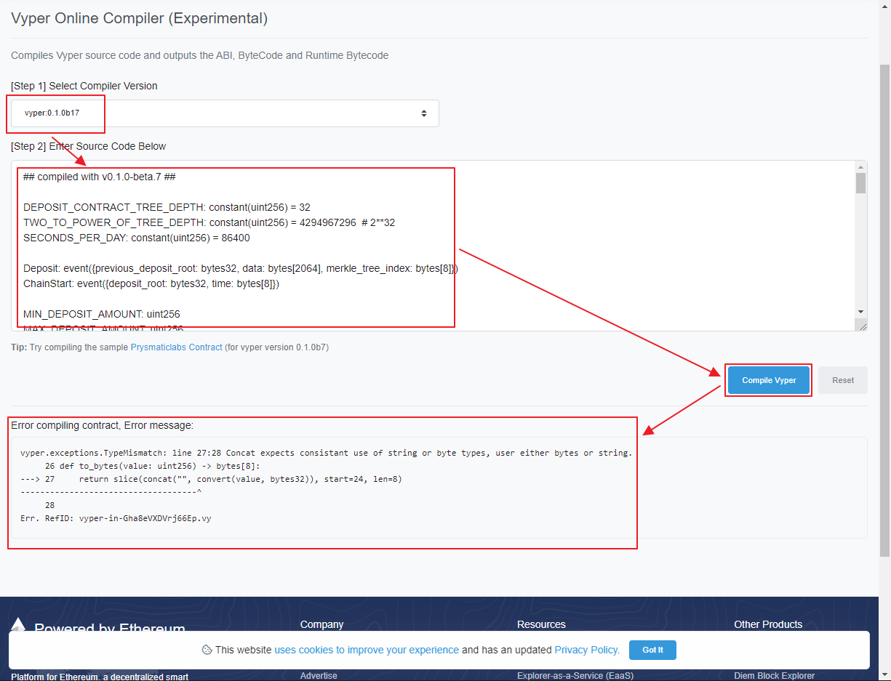

# Chapter 8. 스마트 컨트랙트와 바이퍼

# 개요

바이퍼란? 개발자들이 이해하기 쉬운 코드를 작성토록 하여 감사 용이성!을 제공
바이퍼의 주요 원칙 중 하나는 개발자들이 오독하기 쉬운 코드를 작성 불가토록 하자!는 것

- 스마트 컨트랙트의 공통적 문제 살펴보기
- 바이퍼 컨트랙스 프로그래밍 소개
- 바이퍼  vs 솔리디티


# 1. 취약점과 바이퍼

- 출판 시점기준 약 백만개의 이더리움 스마트 컨트랙트 분석결과 아사리판임을 확인
- 취약점 3유형
    - 자기파괴 컨트랙트(sucidal contract)

        아무 주소를 이용해서 삭제시킬 수 있는 스마트 컨트랙트

    - 탐욕 컨트랙트(greedy contract)

        이더를 뺴올 수 없도록 막아버리는 상태에 도달 할 수 있는 컨트랙트

    - 방탕한 컨트랙트(prodigal contract)

        이더를 아무런 주소로 보낼 수 있게 만든 스마트 컨트랙트

- 잘못된 스마트 컨트랙트 코드는 이더리움 사용자에게 예상치 못한 자금 손실 초래 가능
- 바이퍼는 취약점 있는 코드를 작성하기 어렵게 함


# 2. 솔리디티와 비교

- `바이퍼`의 `안전치 않은 코드` 작성 `방지 방법`중 하나
    - 의도적으로 `솔리디티 기능` 중 `일부`를 `생략`
- 생략기능 6가지
    1. 변경자

        ```jsx
        modifier onlyBy(address _account)
        {
            require(msg.sender == _account);
            _;
        }

        # 변경자 OnlyBy에서 코드 실행
        function changeOwner(address _newOwner)
            public
            onlyBy(owner)
        {
            owner = _newOwner;
        }
        ```

        ```jsx
        enum Stages {
            SafeStage,
            DangerStage,
            FinalStage
        }

        uint public creationTime = now;
        Stages public stage = Stages.SafeStage;

        function nextStage() internal {
            stage = Stages(uint(stage) + 1);
        }

        modifier stageTimeConfirmation() {
            if (stage == Stages.SafeStage &&
                        now >= creationTime + 10 days)
                nextStage();
            _;
        }

        function a()
            public
            stageTimeConfirmation
            // More code goes here
        {
        }
        ```

        - a() ⇒ `stageTimeConfirmation()` ⇒ nextStage() ⇒ stage = DangerStage
    2. 클래스상속

        상속이란? 물려받는거! 기존 소프트웨어나 라이브러리에서 기능, 속성 및 동작 등을 물려받아 사용, 이는 강력한 기능이며 코드 재사용을 도와줌
        그르나 `바이퍼 세상에서는 짤없음!` 왜? 다중 상속이 코드를 너무 이해하기 어렵고 복잡하게 만든다 띵킹함! 누가? 바이퍼가!

    3. 인라인 어셈블리

        솔리디티 프로그램이 EVM 명령어에 직접 접근하여 작업을 수행
        0x80에 3을 더하는 예시 : 3 0x80 mload add 0x80 mstore

    4. 함수 오버로딩

        ```jsx
        function f(uint _in) public pure returns (uint out) {
            out = 1;
        }

        function f(uint _in, bytes32 _key) public pure returns (uint out) {
            out = 2;
        }
        ```

    5. 변수 형변환

        ```jsx
        uint32 a = 0x12345678;
        uint16 b = uint16(a);
        // Variable b is 0x5678 now

        def convert(expr, context):
            output_type = expr.args[1].s
            if output_type in conversion_table:
                return conversion_table[output_type](expr, context)
            else:
                raise Exception("Conversion to {} is invalid.".format(output_type))

        conversion_table = {
            'int128': to_int128,
            'uint256': to_unint256,
            'decimal': to_decimal,
            'bytes32': to_bytes32,
        }

        @signature(('int128', 'uint256', 'bytes32', 'bytes'), 'str_literal')
        def to_int128(expr, args, kwargs, context):
            in_node = args[0]
            typ, len = get_type(in_node)
            if typ in ('int128', 'uint256', 'bytes32'):
                if in_node.typ.is_literal
                    and not SizeLimits.MINNUM <= in_node.value <= SizeLimits.MAXNUM:
                    raise InvalidLiteralException(
                        "Number out of range: {}".format(in_node.value), expr
                    )
                return LLLnode.from_list(
                    ['clamp', ['mload', MemoryPositions.MINNUM], in_node,
                    ['mload', MemoryPositions.MAXNUM]], typ=BaseType('int128'),
                    pos=getpos(expr)
                )
            else:
                return byte_array_to_num(in_node, expr, 'int128')
        ```

        - `명시적 형변환` 선택은 `코드`를 `장황`하게 하지만 `안전성`과 `감사 용의성`은 `향상`!
    6. 전제 조건과 사후 조건
        - 바이퍼는 전제, 사후, 상태 변경을 명시적으로 처리
            - 중복코드 생성되나 최대한의 가독성, 안전성을 보장하게 됌
        - 바이퍼 개발시 검토사항 3요소
            - 조건
                - 이더리움 상태 변수의 현재 상태/조건은 무엇인가?
            - 효과
                - 이 스마트 컨트랙트 코드가 실행 시 상태 변수의 조건에 어떤 영향을 미치나?
                - 어떤 영향을 받고, 어떤 영향을 받지 않을 것인가?
                - 위 사항들이 스마트 컨트랙드의 의도와 일치하는가?
            - 상호작용
                - 위 두 고려사항을 철저히 다룬 후 `배포전에 코드를 논리적, 단계적으로 실행, 다른 컨트랙트와 상호작용을 포함하여 코드를 실행할 때 발생 할 수 있는 모든 영구적인 결과, 그에 따른 효과, 시나리오를 고려`하라.
                - 이게 말이 되나!! ㅡㅡ;; 한마디로 절라게 유심히 한땀한땀 보고 잘 짜라! ㅡㅡ;;


# 장식자

- 바이퍼 장식자 4가지
    - @private

        해당 함수를 외부에 비공개 함

    - @public

        해당 함수를 외부에 공개하고 실행 가능하게 함

    - @constant

        상태 변수를 변경 할 수 없게 함

    - @payable

        값을 전송 할 수 있게 함


# 함수와 변수 순서

바이퍼는 모든 함수와 변수가 한곳에 몰빵 되어 있어야 함!
또한 먼저 선언되어 있어야 사용이 가능함!

- 솔리디티

    ```jsx
    pragma solidity ^0.4.0;

    contract ordering {

        function topFunction()
        external
        returns (bool) {
            initiatizedBelowTopFunction = this.lowerFunction();
            return initiatizedBelowTopFunction;
        }

        bool initiatizedBelowTopFunction;
        bool lowerFunctionVar;

        function lowerFunction()
        external
        returns (bool) {
            lowerFunctionVar = true;
            return lowerFunctionVar;
        }

    }
    ```

- 바이퍼

    ```jsx
    # Declare a variable called theBool
    theBool: public(bool)

    # Declare a function called topFunction
    @public
    def topFunction() -> bool:
        # Assign a value to the already declared variable called theBool
        self.theBool = True
        return self.theBool

    # Declare a function called lowerFunction
    @public
    def lowerFunction():
        # Call the already declared function called topFunction
        assert self.topFunction()
    ```


# 컴파일

- 바이퍼 자체 온라인 코드 편집 & 컴파일러
    - ~~[https://vyper.online](https://vyper.online) `[링크 죽음]`~~

        [](https://vyper.online)

    - [https://etherscan.io/vyper](https://etherscan.io/vyper)

        [](https://etherscan.io/vyper)

- 뭐가 잘 안됌

    


# 컴파일러 수준에서 오버플로 오류방지

- 소프트웨어 오버플로 오류는 실제 값을 다룰 때 치명적일 수 있음
- 2018년 4월 중순 발생한 BEC 토큰 이체 오버플로

    ```bash
    57,896,044,618,658,100,000,000,000,000,000,000,000,000,000,000,000,000,000,000
    ```

- 솔리디티에서는 SafeMath, Mythril OSS 같은 스마트 컨트랙트 보안 분석도구 제공
- 보안 분석도구 사용이 의무는 아니어서 정신차리고 개발 안하면 클남
- 바이퍼는 2단계 접근법으로 구현된 오버플로 방지 기능 내장
    - 바이퍼는 정수 연산에 필요한 예외 사례를 포함한 SafeMeth와 동일한 기능을 제공
    - 바이퍼는 리터럴 상수가 로드되거나 값이 함수에 전달되거나 변수가 할당될 때마다 클램프(clamp)를 사용 클램프는 LLL(Low-level Lisp-like Language) 컴파일러에서 사용자 지정 함수로 구현하며, 비활성화 할 수 없도록 되어 있음


# 데이터 읽기 및 쓰기

- 스토리지 작업 즉, 데이터 R/W/U는 많은 비용이 들지만 스마트 컨트랙트의 필수 요소들임
- 스마트 컨트랙트에서 데이터 저장 가능한 두곳
    - 글로벌 상태
        - 스마트 컨트랙트의 상태 변수는 이더리움 글로벌 상태 트리에 저장
        - 스마트 컨트랙트는 그 컨트랙트의 주소와 관련하여 오직 데이터의 저장, 읽기, 수정만 가능[즉, 스마트 컨트랙트는 다른 스마트 컨트랙트를 읽거나 쓸 수 없다]
    - 로그
        - 스마트 컨트랙트는 로그 이벤트를 통해 이더리움 체인 데이터에 데이터를 쓸 수 있음
        - 초기 __log__ 구문 사용
            - 예) MyLog 이벤트 선언

                예전: MyLog: __log__({arg1: indexed(bytes[3])})

                현재: MyLog: event({arg1: indexed(bytes[3])})

            - MyLog 이벤트 실행

                log.MyLog("123")

        - 스마트 컨트랙트는 그들이 만든 온체인 로그 이벤트를 읽지 못하나, 라이트 클라이언트로 찾아서 읽을 수 있음.
        - 채굴된 블록의 logsBloom 값은 로그 이벤트 존재 여부를 나타낼 수 있음, 로그 이벤트가 설정되면 로그 데이터를 주어진 트랜잭션 영수증에서 얻을 수 있음


# 결론

- 바이퍼는 유연성 보다는 정확성!
- 모호하거나 코드를 복잡하게 만드는 아이들 제거!
- 조금 복잡하게 하더라도 명확하게 선언! 또는 변환!